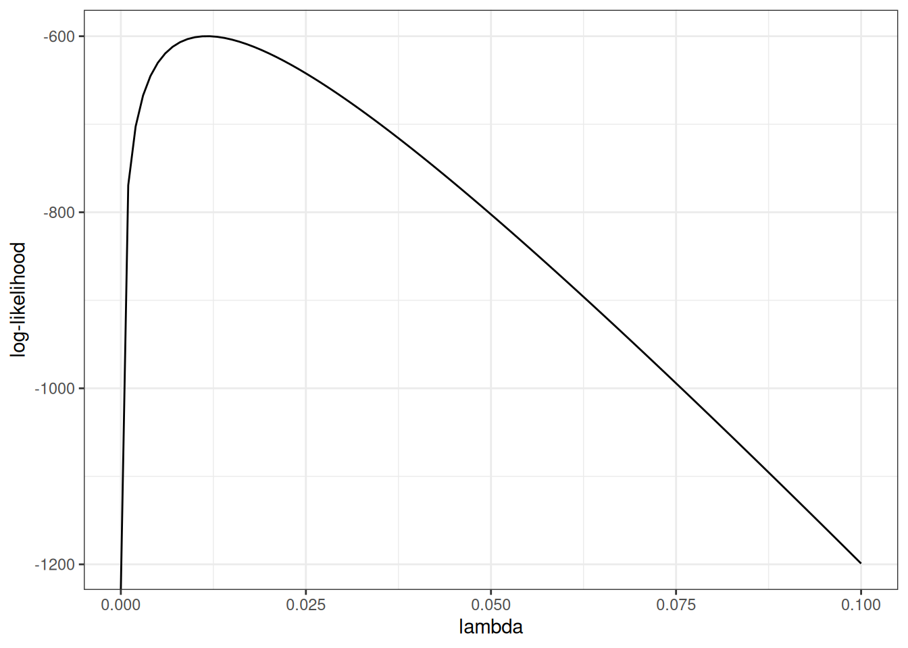
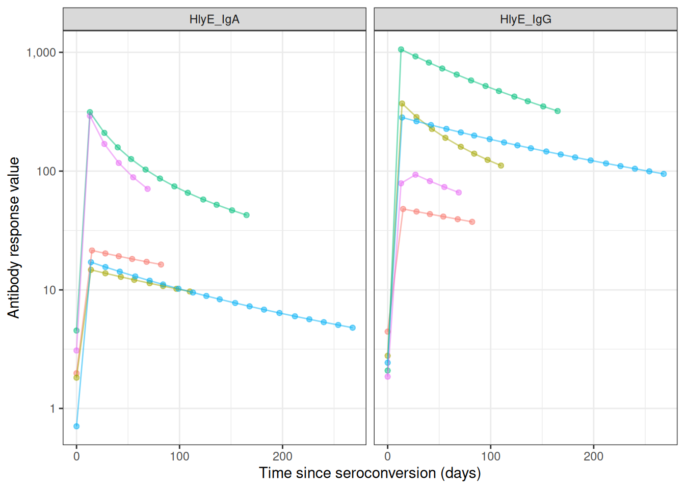
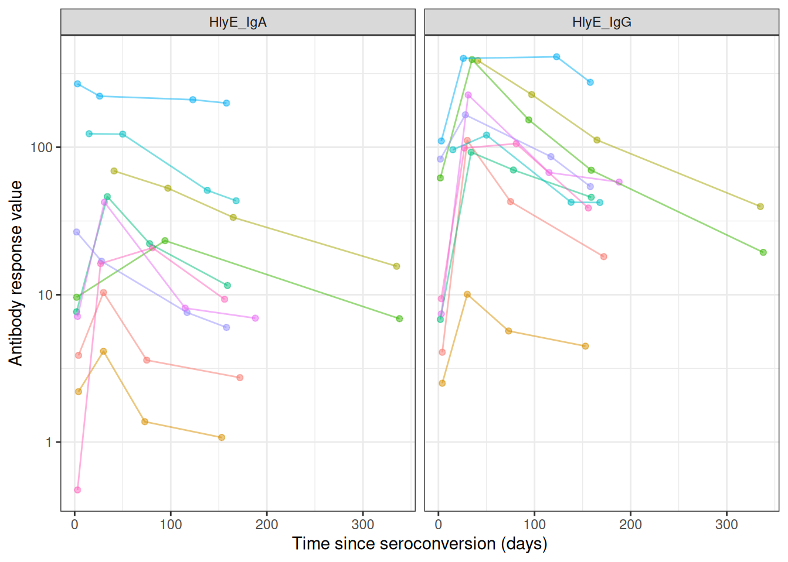
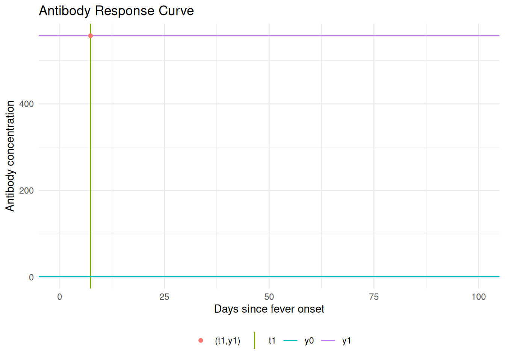
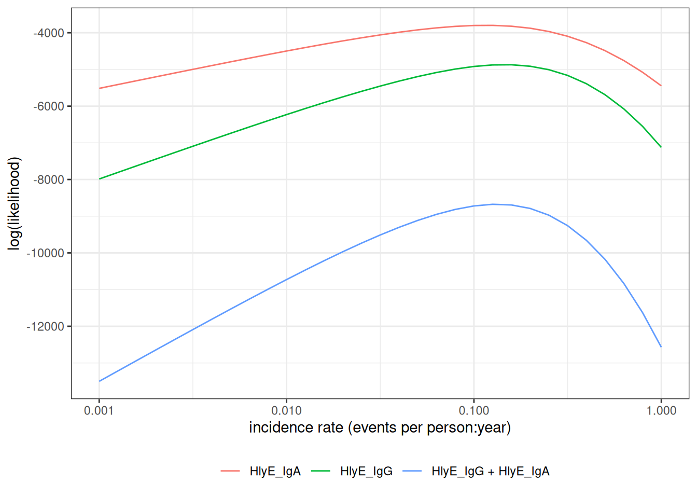

# Estimating Incidence Rates from Cross-Sectional Serosurveys

## Infectious disease epidemiology

### *Salmonella* enterica (“typhoid fever”)

- ~21.7 million symptomatic cases/year
- ~217,000 deaths/year (~1% case fatality with treatment; up to 20%
  untreated)
- Highest burden: ages 5–19
- **Symptoms:** sustained high fever, severe headache, abdominal pain,
  malaise; rose-spot rash (~30% of patients); constipation (early) or
  diarrhea (later)


### *Shigella* (“dysentery”)

- ~100 million infections annually
- ~100,000 deaths annually (~1% case fatality; higher in malnourished
  children)
- Most cases and deaths: children under 5 in low- and middle-income
  countries (LMICs)
- **Symptoms:** bloody diarrhea (dysentery), abdominal cramps, fever,
  tenesmus (painful urge to defecate)


*Shigella* in a stool sample. Photo: CDC/PHIL (public domain), via
[Wikimedia
Commons](https://commons.wikimedia.org/wiki/File:Shigella_stool.jpg).

### *Orientia tsutsugamushi* (“scrub typhus”)

- ~1,000,000 infections/year
- ~10,000 deaths/year (~1% case fatality with treatment; up to 30%
  untreated)
- **Symptoms:** high fever, severe headache, myalgia; eschar
  (pathognomonic black scab at mite-bite site); macular rash; cough;
  gastrointestinal symptoms; hemorrhage in severe cases


*Trombicula* mite larva with stylostome. Photo: Alan R Walker /
[Wikimedia
Commons](https://commons.wikimedia.org/wiki/File:Trombicula-larva-stylostome.jpg),
[CC BY-SA 3.0](https://creativecommons.org/licenses/by-sa/3.0/).

## Why estimate incidence from serosurveys?

### The burden-data gap

- Typhoid conjugate vaccines (TCVs) are **80-90% effective** and
  WHO-recommended since 2018, but **few countries** have adopted them
  into routine immunization.

- A major barrier is the **lack of burden data**: most low- and
  middle-income countries lack robust typhoid surveillance and have
  little or no incidence data.

- These gaps block applications for vaccine funding, widening **equity
  gaps** in access to effective vaccines.


Countries with routine TCV introduction as of 2023. Source: CDC MMWR
72(7):182–188 (public domain).

Three large randomized trials showed that a Vi tetanus-toxoid typhoid
conjugate vaccine is 80-90% effective at preventing symptomatic typhoid,
and the WHO has recommended these vaccines since 2018. Yet as of 2023
only a handful of countries had introduced them into routine
immunization. The binding constraint is data: without incidence
estimates, countries cannot make the case for vaccine funding.

“Data inequality is our biggest challenge moving forward” — Kathy
Neuzil, 2023

{{\< slidebreak \>}}

### Seroepidemiology can fill the gap

The Seroepidemiology and Environmental Surveillance for Enteric Fever
(SEES) study collected cross-sectional serosurveys across multiple
countries to estimate typhoid incidence from antibody data ([Aiemjoy et
al. 2022](#ref-Aiemjoy_2022_Lancet)).

This lecture describes the methodology behind that kind of estimate: how
a single cross-sectional serosurvey, combined with a model of antibody
dynamics, can recover an incidence rate.

### Defining incidence

**Definition 1 (Population incidence rate)** The **incidence rate** of a
disease over a **specific time period** is the rate at which individuals
in a population are *acquiring* the disease during that time period
([Noordzij et al. 2010](#ref-Noordzij2010diseasemeasures)).

{{\< slidebreak \>}}

**Example 1 (Population incidence rate)** If there are **10 new cases**
of typhoid in a population of **1000 persons** during a **one month**
time period, then the **incidence rate** for that time period is **10
new cases per 1000 persons per month**.

### Mathematical definition of incidence

More precisely, the incidence rate at time $`t`$ is the **rate of new
infections per person at risk**:

``` math
\lambda_t = \frac{1}{N(t)}\,\frac{d}{dt}\,\mathbb{E}[C(t)]
```

where $`C(t)`$ is the cumulative number of infections and $`N(t)`$ the
number of individuals at risk at time $`t`$.

### Scale of incidence rates

In both definitions, the units for an incidence rate are “# new
infections per \# persons at risk per time duration”; for example, “new
infections per 1000 persons per year”.

For convenience, we can rescale the incidence rate to make it easier to
understand; for example, we might express incidence as “# new infections
per 1000 persons per year” or “# new infections per 100,000 persons per
day”, etc.

### Incidence from an individual’s perspective

From the perspective of an individual in the population:

- the **incidence rate** (at a given time point $`t`$) is the
  instantaneous **probability density** of **becoming infected** at that
  time point, **given** that they are **at risk** at that time point.

- That is, the incidence rate is a **hazard** rate.

- Notation: let’s use **$`\lambda_{t}`$** to denote the incidence rate
  at time $`t`$.

## Study designs for estimating incidence rates

### Longitudinal cohort studies

Incidence rates can be estimated from longitudinal cohort studies, but
cohort studies are:

- costly to conduct
- slow to produce results,
- vulnerable to selection and censoring (drop-out) biases

### Clinical case data

Incidence rates can also be estimated from clinical case rates, but
clinical case rates undercount:

- asymptomatic cases
- symptomatic cases who don’t receive clinical care.

### Cross-sectional serosurveys

Alternatively, incidence rates can be estimated from biomarker data
collected through a single cross-sectional survey, combined with a
longitudinal model of how those biomarkers respond to infection over
time. Compared with cohort studies and clinical case rates,
cross-sectional incidence estimation can produce estimates that are:

- accurate
- timely
- cost-efficient

See Hay et al. ([2024](#ref-HAY2024100806)) for overview

## Estimating incidence from cross-sectional serosurveys

### Goal

> Easily and reproducibly translate **quantitative antibody responses**
> at the population level into meaningful and accurate **epidemiological
> measures of infection burden**.

### Antibody responses are complicated

Using antibody levels to recover infection times is hard, because
antibody responses:

- **decay over time** after infection
- **vary from individual to individual** (age, immune function, prior
  infections, vaccination)
- **vary from measurement to measurement** (assay noise)
- can **cross-react** with antibodies from other exposures

Each of these complications has to be handled somewhere in the model:
waning, between-person heterogeneity, measurement error, and
cross-reactivity. The rest of this section builds that model up piece by
piece.

### Cross-sectional antibody surveys

Typically, it is difficult to estimate changes from a single time point.
However, we can sometimes make assumptions that allow us to do so. In
particular, if we assume that the incidence rate is constant over time,
then we can estimate incidence from a single cross-sectional survey.

We will need two pieces of notation to formalize this process.

- We recruit participants from the population of interest.

- For each survey participant, we measure antibody levels $`(Y)`$ for
  the disease of interest

- Each participant was **most recently infected** at some time
  $`(T)`$**prior** to when we measured their antibodies.

- If a participant has never been infected since birth, then $`T`$ is
  undefined.

- $`T`$ is a **latent, unobserved variable**.

- We **don’t directly observe $`T`$**; we **only observe $`Y`$**, which
  we hope tells us something about $`T`$ and $`\lambda`$.

### Modeling assumptions

We **assume** that:

- The incidence rate is approximately **constant** **over time** and
  **across the population** (“**constant and homogenous incidence**”)

- that is:
  ``` math
  \lambda_{i,t} = \lambda, \forall i,t
  ```

(We can analyze subpopulations separately to make homogeneity more
plausible.)

- Participants are always at risk of a new infection, regardless of how
  recently they have been infected (“**no lasting immunity**”).

(For diseases like typhoid, the no-immunity assumption may not hold
exactly, but hopefully approximately; modeling the effects of
re-exposure during an active infection is [on our to-do
list](https://github.com/UCD-SERG/serodynamics/issues/11)).

### Time since infection and incidence

Under those assumptions:

. . .

- $`T`$ has an **exponential distribution**:

. . .

\$\$\operatorname{p}(T=t) =
\textcolor{red}{\lambda\operatorname{exp}\mathopen{}\left\\-\lambda
t\right\\\mathclose{}}\$\$

. . .

- More precisely, the distribution is exponential **truncated by age**
  at observation ($`a`$):

. . .

\$\$ \operatorname{p}(T=t\|A=a) = 1\_{t \in\[0,a\]}
\textcolor{red}{\lambda \operatorname{exp}\mathopen{}\left\\-\lambda
t\right\\\mathclose{}} + 1\_{t = \text{NA}}
\operatorname{exp}\mathopen{}\left\\-\lambda a\right\\\mathclose{} \$\$

. . .

- the rate parameter $`\lambda`$ is the incidence rate

This is a time-to-event model, looking **backwards in time** from the
survey date (when the blood sample was collected).

The probability that an individual was **last** infected $`t`$ days ago,
$`p(T=t)`$, is equal to the probability of being infected at time $`t`$
(i.e., the incidence rate at time $`t`$, $`\lambda`$) times the
probability of not being infected after time $`t`$, which turns out to
be
$`\operatorname{exp}\mathopen{}\left\{-\lambda t\right\}\mathclose{}`$.

The distribution of $`T`$ is truncated by the patient’s birth date; the
probability that they have never been infected is
$`\operatorname{exp}\mathopen{}\left\{-\lambda a\right\}\mathclose{}`$,
where $`a`$ is the patient’s age at the time of the survey.

### Likelihood of latent infection times

If we could observe $`T`$, then we could estimate $`\lambda`$ using a
typical maximum likelihood approach.

. . .

Starting with the likelihood:

``` math
\mathscr{L}^*(\lambda) = \prod_{i=1}^n \operatorname{p}(T=t_i \mid \lambda) = \prod_{i=1}^n \lambda \operatorname{exp}\mathopen{}\left\{-\lambda t_i\right\}\mathclose{}
```

. . .

Taking the logarithm of the likelihood:

``` math
\ell^*(\lambda) = \operatorname{log}\mathopen{}\left\{\mathscr{L}^*(\lambda)\right\}\mathclose{} = \sum_{i=1}^n \operatorname{log}\mathopen{}\left\{\lambda\right\}\mathclose{} -\lambda t_i
```

. . .

Taking the derivative of that log-likelihood to find the score function:

``` math
\ell^{*'}(\lambda) = \sum_{i=1}^n \mathopen{}\left(\lambda\right)^{-1}\mathclose{} - t_i
```

. . .

Setting the score function equal to 0 to find the score equation, and
solving the score equation for $`\lambda`$ to find the maximum
likelihood estimate:

``` math
\hat{\lambda}_{\text{ML}} = \frac{n}{\sum_{i=1}^n t_i} = \frac{1}{\bar{t}}
```

The MLE turns out to be the inverse of the mean.

### Example log-likelihood curves

Here’s what that would look like:

``` r

library(serodynamics)
library(serocalculator)
```


    Attaching package: 'serocalculator'

    The following object is masked from 'package:serodynamics':

        expect_snapshot_data

``` r

library(dplyr)
```


    Attaching package: 'dplyr'

    The following objects are masked from 'package:stats':

        filter, lag

    The following objects are masked from 'package:base':

        intersect, setdiff, setequal, union

``` r

antibodies <- c("HlyE_IgA", "HlyE_IgG")
set.seed(1)

sim_case_data <-
  serocalculator::typhoid_curves_nostrat_100 |>
  sim_case_data(n = 5, 
                antigen_isos = antibodies,
                max_n_obs = 20, followup_interval = 14)

t1 <- sim_case_data$timeindays
loglik0 <- function(lambda) {
  sum(
    dexp(t1, rate = lambda, log = TRUE)
  )
}
loglik1 <- Vectorize(loglik0, vectorize.args = "lambda")

library(ggplot2)

ggplot() + 
  geom_function(fun = loglik1) +
  xlim(0, .1) +
  theme_bw() +
  xlab("lambda") +
  ylab("log-likelihood")
```



Figure 1: log-likelihood curve for latent data

### Standard errors

The standard error of the estimate is approximately equal to the inverse
of the curvature (2nd derivative, aka Hessian) of the log-likelihood
function, at the maximum:

more curvature $`\rightarrow`$ a sharper likelihood peak $`\rightarrow`$
smaller standard errors

### Hessian for the exponential model

For the latent-time exponential model, the log-likelihood is
``` math
\ell^*(\lambda) = n\operatorname{log}\mathopen{}\left\{\lambda\right\}\mathclose{} - \lambda\sum_{i=1}^n t_i
```

so the score and the Hessian (here a scalar second derivative) are

``` math
\ell^{*\prime}(\lambda) = \frac{n}{\lambda} - \sum_{i=1}^n t_i,
\qquad
\ell^{*\prime\prime}(\lambda) = -\frac{n}{\lambda^2}
```

The observed information is
$`\mathcal{I}(\lambda) = -\ell^{*\prime\prime}(\lambda) = n/\lambda^2`$.

Evaluated at the MLE $`\hat\lambda = 1/\bar t`$, the variance and
standard error are

``` math
\widehat{\operatorname{Var}}(\hat\lambda) \approx
\left[-\ell^{*\prime\prime}(\hat\lambda)\right]^{-1} = \frac{\hat\lambda^2}{n},
\qquad
\operatorname{SE}(\hat\lambda) \approx \frac{\hat\lambda}{\sqrt{n}}
```

So more curvature (larger $`n/\lambda^2`$) means a sharper peak and a
smaller standard error, consistent with the previous slide.

### Likelihood of observed data

Unfortunately, we don’t observe infection times $`T`$; we only observe
antibody levels $`{Y}`$. So things get a little more complicated.

In short, we are hoping that we can estimate $`T`$ (time since last
infection) from $`Y`$ (current antibody levels). If we could do that,
then we could plug in our estimates $`\hat t_i`$ into that likelihood
above, and estimate $`\lambda`$ as previously.

We’re actually going to do something a little more nuanced; instead of
just using one value for $`\hat t`$, we are going to consider all
possible values of $`t`$ for each individual.

We need to link the data we actually observed to the incidence rate.

The likelihood of an individual’s observed data,
$`\operatorname{p}(Y=y)`$, can be expressed as an integral over the
joint likelihood of $`Y`$ and $`T`$ (using the Law of Total
Probability):

- 
  ``` math
  \operatorname{p}(Y=y) = \int_t \operatorname{p}(Y=y,T=t)dt
  ```

Further, we can express the joint probability $`p(Y=y,T=t)`$ as the
product of $`p(T=t)`$ and $`p(Y=y|T=t)`$ the “antibody response curve
after infection”. That is:

- 
  ``` math
  \operatorname{p}(Y=y,T=t) = \operatorname{p}(Y=y|T=t) \operatorname{p}(T=t)
  ```

### Antibody response curves

``` r

sim_case_data |>
  autoplot(alpha = .5)
```



Figure 2: Antibody response curves, $`p(Y=y|T=t)`$, for typhoid

{{\< slidebreak \>}}

``` r

case_data <-
    serodynamics_example(
      "SEES_Case_Nepal_ForSeroKinetics_02-13-2025.csv"
    ) |>
    readr::read_csv() |>
    dplyr::mutate(
      .by = person_id,
      visit_num = dplyr::row_number()
    ) |>
    as_case_data(
      id_var = "person_id",
      biomarker_var = "antigen_iso",
      value_var = "result",
      time_in_days = "dayssincefeveronset"
    )
```

    Rows: 904 Columns: 8
    ── Column specification ────────────────────────────────────────────────────────
    Delimiter: ","
    chr (6): Country, person_id, sample_id, bldculres, antigen_iso, studyvisit
    dbl (2): dayssincefeveronset, result

    ℹ Use `spec()` to retrieve the full column specification for this data.
    ℹ Specify the column types or set `show_col_types = FALSE` to quiet this message.

``` r

most_obs <-
  case_data |>
  count(id) |> 
  arrange(desc(n)) |> 
  head(10)
  
case_data |> 
  semi_join(most_obs, by = "id") |> 
    autoplot(alpha = .5, log_x = FALSE)
```



Figure 3: Observed antibody measurements over time since fever onset,
for typhoid

### The per-person likelihood

Substituting $`p(Y=y,T=t) = p(Y=y|T=t)\,p(T=t)`$ into the previous
expression for $`p(Y=y)`$:

``` math
\begin{aligned}
p(Y=y)
&= \int_t p(Y=y|T=t)\,p(T=t)\, dt
\end{aligned}
```

### The full-sample likelihood

Now, the likelihood of the observed data
$`\tilde{y} = (y_1, y_2, ..., y_n)`$ is:

``` math
\begin{aligned}
\mathcal{L}(\lambda)
&= \prod_{i=1}^n p(Y=y_i)
\\&= \prod_{i=1}^n \int_t p(Y=y_i|T=t)p_\lambda(T=t)dt\\
\end{aligned}
```

If we know $`p(Y=y|T=t)`$, then we can maximize $`\mathcal{L}(\lambda)`$
over $`\lambda`$ to find the “maximum likelihood estimate” (MLE) of
$`\lambda`$, denoted $`\hat\lambda`$.

### Finding the MLE numerically

The likelihood of $`Y`$ involves the product of integrals, so the
log-likelihood involves the sum of the logs of integrals:

``` math
\begin{aligned}
\log \mathcal{L} (\lambda)
&= \log \prod_{i=1}^n \int_t p(Y=y_i|T=t)p_\lambda(T=t)dt\\
&= \sum_{i=1}^n \log\left\{\int_t p(Y=y_i|T=t)p_\lambda(T=t)dt\right\}\\
\end{aligned}
```

The derivative of this expression doesn’t come out cleanly, so we will
use a *numerical method* (specifically, a Newton-type algorithm,
implemented by [`stats::nlm()`](https://rdrr.io/r/stats/nlm.html)) to
find the MLE and corresponding standard error.

### Cluster-robust standard errors for clustered sampling designs

In many survey designs, observations are clustered (e.g., multiple
individuals from the same household, school, or geographic area).
Observations within the same cluster are often more similar to each
other than to observations from different clusters, violating the
independence assumption of standard maximum likelihood estimation.

#### Why clustering matters

When observations are clustered:

- Individuals within the same cluster share common exposures or
  characteristics
- Standard errors that ignore clustering will be **too small**
  (anti-conservative)
- Confidence intervals will be **too narrow**
- p-values will be **too optimistic**

#### Cluster-robust variance estimation

To account for within-cluster correlation, `serocalculator` implements
the **sandwich estimator** (also known as the Huber-White robust
variance estimator):

``` math
V_{\text{robust}} = H^{-1} B H^{-1}
```

where:

- $`V_{\text{robust}}`$ is the cluster-robust variance-covariance matrix
  for the parameter estimates
- $`H`$ is the Hessian matrix (matrix of second partial derivatives of
  the log-likelihood with respect to the parameters, evaluated at the
  MLE $`\hat{\lambda}`$)
- $`B`$ is the “meat” of the sandwich, calculated from cluster-level
  score contributions:

``` math
B = \sum_{c=1}^C U_c U_c^T
```

where:

- $`C`$ is the total number of clusters in the sample
- $`U_c = \sum_{i \in c} \nabla_\lambda \log p(Y_i | \lambda)`$ is the
  score contribution (gradient of log-likelihood with respect to
  $`\lambda`$) from all observations in cluster $`c`$
- $`\nabla_\lambda`$ denotes the gradient operator (vector of partial
  derivatives with respect to the parameter $`\lambda`$)

#### Implementation in serocalculator

Users can specify clustering using the `cluster_var` parameter:

``` r

# Single-level clustering (e.g., by household)
est <- est_seroincidence(
  pop_data = data,
  cluster_var = "household_id",
  ...
)

# Multi-level clustering (e.g., schools within districts)
est <- est_seroincidence(
  pop_data = data,
  cluster_var = c("district_id", "school_id"),
  ...
)
```

When cluster-robust standard errors are used, the
[`summary()`](https://rdrr.io/r/base/summary.html) output indicates this
with `se_type = "cluster-robust"`.

#### Effect on results

- **Point estimates** (incidence rates) remain unchanged
- **Standard errors** often increase to reflect within-cluster
  correlation
- **Confidence intervals** appropriately widen to account for reduced
  effective sample size

## Modeling the seroresponse kinetics curve

Now, we need a model for the antibody response to infection,
$`\operatorname{p}(Y=y|T=t)`$. The current version of the
[serocalculator](https://ucd-serg.github.io/serocalculator/) package
uses a two-phase model for the shape of the seroresponse ([Teunis et al.
2016](#ref-Teunis_2016)).

### Model for active infection period

The first phase of the model represents the **active infection period**,
and uses a simplified Lotka-Volterra predator-prey model ([Volterra
1928](#ref-volterra1928variations)) where the pathogen is the prey and
the antibodies are the predator:

Notation:

- $`x(t)`$: pathogen concentration at time $`t`$
- $`y(t)`$: antibody concentration at time $`t`$
- $`\mu_0`$: pathogen growth rate; $`\beta`$: pathogen-inactivation
  strength; $`\mu`$: antibody growth rate

Model:

- 
  ``` math
  x'(t) = \mu_0\, x(t) - \beta y(t)
  ```
- 
  ``` math
  y'(t) = \mu\, y(t)
  ```

With baseline antibody concentration $`y(0) = y_{0}`$ and initial
pathogen concentration $`x(0) = x_{0}`$.

Compared to the standard LV model:

- the predation term with the $`\beta`$ coefficient is missing the prey
  concentration $`x(t)`$ factor; we assume that the efficiency of
  predation doesn’t depend on pathogen concentration.

- the differential equation for predator density is missing the predator
  death rate term $`-\gamma y(t)`$; we assume that as long as there are
  any pathogens present, the antibody decay rate is negligible compared
  to the growth rate.

- the predator growth rate term $`\mu\, y(t)`$ is missing the prey
  density factor $`x(t)`$; we assume that as long as there are any
  pathogens present, the antibody concentration grows at the same
  exponential rate.

These omissions were made to simplify the estimation process, under the
assumption that they are negligible compared to the other terms in the
model.

### Model for post-infection antibody decay

Once the immune response clears the infection, the pathogen
concentration reaches zero, so antibody production is no longer
stimulated and the antibody concentration decays.

Once the pathogen is cleared ($`x(t) = 0`$), the antibody concentration
decays:

- 
  ``` math
  y^{\prime}(t) = -\alpha y(t)^r
  ```

Antibody decay is different from exponential (log–linear) decay. When
the shape parameter $`r > 1`$, log concentrations decrease rapidly after
infection has terminated, but decay then slows down and low antibody
concentrations are maintained for a long period. If $`r = 1`$, this
model reduces to exponential decay with decay rate $`\alpha`$.

### Assembling the full response curve

The serum antibody response $`y(t)`$ can be written as

``` math
y(t) = y_{+}(t) + y_{-}(t)
```

where

``` math
\begin{align}
y_{+}(t) & = y_{0}\text{e}^{\mu t}[0\leq t <t_{1}]\\
y_{-}(t) & = y_{1}\left(1+(r-1)y_{1}^{r-1}\alpha(t-t_{1})\right)^{-\frac{1}{r-1}}[t_{1}\le t < \infty]
\end{align}
```

### Growth rate from peak and baseline

Since the peak level is $`y_{1} = y_{0}\text{e}^{\mu t_{1}}`$ the growth
rate $`\mu`$ can be written as
``` math
\mu = \frac{1}{t_{1}}\log\left(\frac{y_{1}}{y_{0}}\right)
```

### From the full model to the observed curve

The antibody curve $`y(t)`$ that we observe and plot falls out of the
two-phase system as follows:

- **During infection** ($`t < t_1`$): the antibody equation
  $`y'(t) = \mu\, y(t)`$ gives exponential growth,
  $`y(t) = y_0\, e^{\mu t}`$.

- The **pathogen equation sets the peak time** $`t_1`$: circulating
  antibodies inactivate the pathogen (the $`-\beta y(t)`$ term), driving
  $`x(t)`$ to zero at $`t_1`$. Once the pathogen is cleared, stimulation
  stops and decay begins, so the peak antibody level is
  $`y_1 = y_0\, e^{\mu t_1}`$.

- **After the peak** ($`t \ge t_1`$): power-law decay,
  $`y'(t) = -\alpha y(t)^r`$.

So the pathogen trajectory $`x(t)`$ never appears in the final antibody
curve — it enters only through the peak time $`t_1`$. From antibody data
alone the pathogen-side quantities ($`\mu_0`$, $`\beta`$, and the
inoculum $`x_0`$) are not separately identifiable ([Teunis et al.
2016](#ref-Teunis_2016)), so the curve is summarized by five parameters:
$`y_0,\ y_1,\ t_1,\ \alpha,\ r`$.

------------------------------------------------------------------------

``` r

cur_ai <- "HlyE_IgG"
```

``` r

library(serocalculator)
library(dplyr)
# Import longitudinal antibody parameters from OSF
curves <-
  "https://osf.io/download/rtw5k/" |>
  load_sr_params() |>
  filter(iter < 50)

curve1 <-
  curves |>
  filter(
    iter == 5,
    antigen_iso == cur_ai
  )
library(ggplot2)

curve1 |>
  # plot_curve_params_one_ab() picks rows via `iter == seq_len(nrow(.))`, so a
  # single pre-filtered curve must be relabelled iter 1 or no curve is drawn.
  mutate(iter = 1) |>
  serocalculator:::plot_curve_params_one_ab(
    log_y = FALSE
  ) +
  xlim(0, 100) +
  theme_minimal() +
  geom_vline(
    aes(
      xintercept = curve1$t1,
      col = "t1"
    )
  ) +

  geom_hline(
    aes(
      yintercept = curve1$y0,
      col = "y0"
    )
  ) +


  geom_hline(
    aes(
      yintercept = curve1$y1,
      col = "y1"
    )
  ) +
  geom_point(
    data = curve1,
    aes(
      x = t1,
      y = y1,
      col = "(t1,y1)"
    )
  ) +
  theme(legend.position = "bottom") +
  labs(col = "")
```

    Scale for x is already present.
    Adding another scale for x, which will replace the existing scale.



Figure 4: An example kinetics curve for HlyE IgG

The antibody level at $`t=0`$ is $`y_{0}`$; the rising branch ends at
$`t = t_{1}`$ where the peak antibody level $`y_{1}`$ is reached. Any
antibody level $`y(t) \in (y_{0}, y_{1})`$ eventually occurs twice.

------------------------------------------------------------------------

An interactive Shiny app lets you manipulate the model parameters:

Interactive Shiny app:
<https://ucdserg.shinyapps.io/antibody-kinetics-model-2/>


QR code for the antibody-kinetics Shiny app

### Biological noise

When we measure antibody concentrations in a blood sample, we are
essentially counting molecules (using biochemistry).

We might miss some of the antibodies (undercount, false negatives) and
we also might incorrectly count some other molecules that aren’t
actually the ones we are looking for (overcount, false positives,
cross-reactivity).

We are more concerned about overcount (cross-reactivity) than
undercount. For a given antibody, we can do some analytical work
beforehand to estimate the distribution of overcounts, and add that to
our model $`p(Y=y|T=t)`$.

Notation:

- $`y_\text{obs}`$: measured serum antibody concentration
- $`y_\text{true}`$: “true” serum antibody concentration
- $`\epsilon_b`$: noise due to probe cross-reactivity

Model:

- $`y_\text{obs} = y_\text{true} + \epsilon_b`$
- $`\epsilon_b \sim \text{Unif}(0, \nu)`$

$`\nu`$ needs to be pre-estimated using negative controls, typically
using the 95th percentile of the distribution of antibody responses to
the antigen-isotype in a population with no exposure.

### Measurement noise

There are also some other sources of noise in our bioassays; user
differences in pipetting technique, random ELISA plate effects, etc.
This noise can cause both overcount and undercount. We can also estimate
the magnitude of this noise source and include it in $`p(Y=y|T=t)`$.

Measurement noise, $`\varepsilon`$ (“epsilon”), represents measurement
error from the laboratory testing process.

Unlike biological noise, measurement noise is *multiplicative*: the
error scales with the true concentration (equivalently, it is additive
on a log scale), and it has mean zero, so on average it neither inflates
nor deflates the measured concentration.

Notation:

- $`y_\text{obs}`$: measured serum antibody concentration
- $`y_\text{true}`$: “true” serum antibody concentration
- $`\xi`$: relative measurement error
- $`\varepsilon`$: bound on the relative error

Model:

- $`y_\text{obs} = y_\text{true} \cdot (1 + \xi)`$
- $`\xi \sim \text{Unif}(-\varepsilon, \varepsilon), \quad 0 \le \varepsilon < 1`$

Here $`\varepsilon`$ is the bound on the relative error, not a
coefficient of variation (CV). Assay precision is often reported as a
CV, the ratio of the standard deviation to the mean for replicates,
ideally measured across plates rather than within the same plate. Under
this uniform model the CV equals $`\varepsilon/\sqrt{3}`$, so a measured
CV corresponds to $`\varepsilon = \sqrt{3}\,\text{CV}`$.

### Combined biological and measurement noise

In practice both noise sources are usually present at once. The two are
applied in sequence ([Teunis and Eijkeren 2020](#ref-Teunis_2020)):
biological noise is added to the true concentration, and measurement
noise then scales the result.

Model:

- $`y_\text{obs} = (y_\text{true} + \epsilon_b)(1 + \xi)`$
- $`\epsilon_b \sim \text{Unif}(0, \nu)`$
- $`\xi \sim \text{Unif}(-\varepsilon, \varepsilon)`$

This is the model `serocalculator` uses whenever a `noise_params` row
has both $`\nu > 0`$ and $`\varepsilon > 0`$; setting either width to
zero recovers the corresponding single-source model above.

### Noise and never-infected subjects

A subject who has never been infected has true antibody concentration
$`y_\text{true} = 0`$; the probability of never having been infected by
age $`a`$ is
$`\operatorname{exp}\mathopen{}\left\{-\lambda a\right\}\mathclose{}`$.
The two noise sources treat such a subject very differently ([Teunis and
Eijkeren 2020](#ref-Teunis_2020)):

- **Biological noise is additive**, so a never-infected subject is
  measured as
  $`y_\text{obs} = 0 + \epsilon_b \sim \text{Unif}(0, \nu)`$.
  Cross-reactivity can register a positive signal even when there was no
  true response, so never-infected subjects still contribute a
  spread-out distribution of small positive values, not a single spike
  at zero.

- **Measurement noise is multiplicative**, so a never-infected subject
  is measured as $`y_\text{obs} = 0 \cdot (1 + \xi) = 0`$. A relative
  error cannot move a true zero, so measurement noise alone leaves these
  subjects exactly at zero.

So the probability mass at $`y = 0`$ from never-infected subjects (with
weight
$`\operatorname{exp}\mathopen{}\left\{-\lambda a\right\}\mathclose{}`$)
survives measurement noise but is smeared into small positive values by
biological noise. This also explains why the biological-noise width
$`\nu`$ can be estimated from a known unexposed population: those
subjects are essentially all never-infected, so their measured antibody
levels are, to good approximation, draws from the biological-noise
distribution itself.

### Multiple biomarkers

``` r

lik_HlyE_IgA <- graph_loglik( # nolint: object_name_linter.
  pop_data = xs_data,
  curve_params = curves,
  noise_params = noise,
  antigen_isos = "HlyE_IgA",
  log_x = TRUE
)

lik_HlyE_IgG <- graph_loglik( # nolint: object_name_linter.
  previous_plot = lik_HlyE_IgA,
  pop_data = xs_data,
  curve_params = curves,
  noise_params = noise,
  antigen_isos = "HlyE_IgG",
  log_x = TRUE
)

lik_both <- graph_loglik(
  previous_plot = lik_HlyE_IgG,
  pop_data = xs_data,
  curve_params = curves,
  noise_params = noise,
  antigen_isos = c("HlyE_IgG", "HlyE_IgA"),
  log_x = TRUE
)

print(lik_both)
```



Figure 5: Example log(likelihood) curves

### Variation in antibody kinetics: by country

Antibody-decay kinetics are not identical across populations. Estimated
seroresponse parameters vary by **country**, **age**, and **serotype**
(*Typhi* vs *Paratyphi* A).


Decay curves (A), peak antibody levels (B), and decay rates (C) for HlyE
and LPS (IgG/IgA), by country (Bangladesh, Pakistan, Nepal, Ghana). SEES
study.

### Variation in antibody kinetics: by age and serotype


Decay curves by age stratum (\<5, 5–15, 16+) and serotype (*Typhi* vs
*Paratyphi* A), for HlyE and LPS (IgG/IgA). SEES study.

This heterogeneity is why we stratify the analysis (for example by
country and age group) and why extending the model to handle covariates
directly is on the roadmap.

## Estimating the curves with `serodynamics`

### Where do the curve parameters come from?

The decay curves above are themselves **estimated** from longitudinal
antibody measurements on **confirmed cases** — individuals with a known
infection date who are sampled repeatedly afterward. Fitting the
two-phase model to those data yields, for each antigen-isotype, the
parameters the incidence model needs:

- baseline antibody level ($`y_0`$)
- peak concentration ($`y_1`$)
- time to peak ($`t_1`$)
- decay rate ($`\alpha`$)
- decay shape ($`r`$)

### The `serodynamics` package

[`serodynamics`](https://github.com/UCD-SERG/serodynamics) is an
open-source R package that fits this two-phase within-host kinetics
model with a **Bayesian hierarchical** model, sampled by MCMC (via
JAGS). The hierarchical structure stabilizes individual-level estimates
by borrowing strength across participants — valuable when longitudinal
data are sparse.

The same modeling framework has been applied to pertussis, typhoid,
scrub typhus, and *Shigella*. Previously each application re-implemented
the JAGS model specification, data formatting, and post-processing by
hand; `serodynamics` packages that into a single reusable, validated
workflow.

### A typical `serodynamics` workflow

``` r

library(serodynamics)

# Longitudinal confirmed-case data (example data ships with the package)
data("nepal_sees")

# Fit the two-phase model by MCMC (JAGS); slow, so not run here
fit <- run_mod(data = nepal_sees, with_post = TRUE)

# Check convergence, then export serocalculator-ready curve parameters
plot_jags_Rhat(fit)
curve_params <- postprocess_jags_output(fit)
```

[`run_mod()`](https://ucd-serg.github.io/serodynamics/reference/run_mod.html)
runs several MCMC chains for tens of thousands of iterations, so a real
fit takes minutes to hours; the package ships ready-made example output
(`nepal_sees_jags_output`) for experimentation.

### What a fitted model looks like

The package ships a cached example fit; `plot_jags_dens()` shows the
posterior densities of the five kinetic parameters (here HlyE IgG,
*Typhi*), overlaid by MCMC chain:

The overlapping chains indicate good convergence.

``` r

data("nepal_sees_jags_output")
plot_jags_dens(nepal_sees_jags_output, iso = "HlyE_IgG", strat = "typhi")
```


Posterior densities of the five kinetic parameters from the cached
`nepal_sees_jags_output` fit (HlyE IgG, *Typhi*), by MCMC chain.

### Two packages, one pipeline

- **`serodynamics`** (upstream): longitudinal **confirmed-case** data
  $`\rightarrow`$ estimated antibody-decay **curve parameters**
- **`serocalculator`** (downstream): a **cross-sectional serosurvey**
  plus those curve parameters $`\rightarrow`$ a **seroincidence**
  estimate

The output of `serodynamics` feeds directly into `serocalculator`’s
[`est_seroincidence_by()`](https://ucd-serg.github.io/serocalculator/reference/est_seroincidence_by.md).

### Propagating uncertainty and heterogeneity

The seroresponse model $`\operatorname{p}(Y=y|T=t)`$ is **not a single
fixed curve**. `serodynamics` returns a posterior **sample** of
curve-parameter sets $`\theta^{(1)},\dots,\theta^{(M)}`$ (each
$`\theta^{(k)} = (y_0, y_1, t_1, \alpha, r)^{(k)}`$), which together
capture both

- **estimation uncertainty** in the kinetics parameters, and
- **between-person / between-case heterogeneity** in the seroresponse.

Each draw is one plausible antibody-response curve; together they
describe the distribution of responses across cases and our uncertainty
about it.

{{\< slidebreak \>}}

The incidence likelihood **averages over these draws** (Monte Carlo
integration), so each person’s contribution becomes

``` math
\operatorname{p}(Y=y) \approx \frac{1}{M}\sum_{k=1}^{M}
\int_t \operatorname{p}(Y=y|T=t, \theta^{(k)})\; \operatorname{p}_\lambda(T=t)\, dt
```

Because the curve-parameter distribution is marginalized into the
likelihood this way, the resulting $`\hat\lambda`$ and its standard
error reflect the seroresponse heterogeneity and the parameter
uncertainty — they are not conditional on a single point-estimated
curve. In `serocalculator` this is the average over the Monte Carlo
parameter sets (the `iter` draws) carried in the curve-parameter object.

## Using `serocalculator`

### An open-source R package

The methods in this lecture are implemented in the open-source
[`serocalculator`](https://github.com/UCD-SERG/serocalculator) R
package.

``` r

library(serocalculator)

# Load antibody-decay curve parameters and cross-sectional population data
curves <- "https://osf.io/download/rtw5k/" |> load_sr_params()
xs_data <- "https://osf.io/download/n6cp3/" |> load_pop_data()
noise <- url("https://osf.io/download/hqy4v/") |> readRDS()

# Visualize the cross-sectional antibody distribution
xs_data |> autoplot(strata = "Country", type = "density")
```

### Estimating seroincidence

``` r

# Estimate incidence, stratified by country and age group
est <- est_seroincidence_by(
  pop_data = xs_data,
  sr_params = curves,
  noise_params = noise,
  strata = c("Country", "ageCat"),
  antigen_isos = c("HlyE_IgG", "HlyE_IgA")
)

summary(est)
```

### Interactive Shiny app

A point-and-click interface is available at
<https://ucdserg.shinyapps.io/shiny_serocalculator/>.


The serocalculator Shiny app.

## Validation: recovering known incidence rates

### Simulating clusters with known incidence

We can check the method by **simulating** cross-sectional serosurveys
with **known** incidence rates and seeing whether the estimates recover
them.
[`sim_pop_data_multi()`](https://ucd-serg.github.io/serocalculator/reference/sim_pop_data_multi.md)
simulates several clusters, each at a specified true rate $`\lambda`$:

``` r

library(serocalculator)

antibodies <- c("HlyE_IgA", "HlyE_IgG")

# Noise settings follow serocalculator's `simulate_xsectionalData` vignette,
# where the estimation noise is kept consistent with the simulated noise.
# Assay-noise parameters for estimation:
noise_params <- tibble::tibble(
  antigen_iso = antibodies,
  nu = 0.5, eps = 0, y.low = 1, y.high = 5e6
)

# Biologic-noise limits for the simulation (vignette `dlims`):
noise_limits <- rbind(
  HlyE_IgA = c(min = 0, max = 0.5),
  HlyE_IgG = c(min = 0, max = 0.5)
)

# Simulate clusters at a range of true incidence rates
sim_df <- sim_pop_data_multi(
  curve_params = typhoid_curves_nostrat_100,
  lambdas = c(0.05, 0.1, 0.2, 0.3), # true incidence rates
  nclus = 3, # clusters per rate
  sample_sizes = 100,
  age_range = c(0, 10),
  antigen_isos = antibodies,
  add_noise = TRUE,
  noise_limits = noise_limits,
  format = "long"
)

# Estimate incidence separately in each simulated cluster
ests <- est_seroincidence_by(
  pop_data = sim_df,
  sr_params = typhoid_curves_nostrat_100,
  noise_params = noise_params,
  strata = c("lambda.sim", "cluster"),
  antigen_isos = antibodies
)
summary(ests)
```

### Estimates recover the simulated rates


Estimated incidence rates (points, with 95% CIs) for the simulated
clusters track the true simulated rates (dashed identity line).

Each point is one simulated cluster: the estimated incidence rate (with
its 95% confidence interval) against the true rate used to generate the
data. The estimates scatter around the identity line, and the intervals
are wider at higher incidence. Abridged from the serocalculator
`simulate_xsectionalData` vignette.

### In-progress work

- Extending and improving existing Shiny apps for these methods (e.g.,
  the [serocalculator Shiny
  app](https://ucdserg.shinyapps.io/shiny_serocalculator/),
  [source](https://github.com/UCD-SERG/shiny_serocalculator))

- Multivariate modeling of biomarkers (relaxing conditional
  independence)

- A graphical (Shiny) app for `serodynamics`

- Modeling time-varying incidence rates

- Accounting for re-exposure

- Accounting for latent immunocompromised subpopulations

- Calibrating to population demographics

### Multiple biomarkers: beyond conditional independence

With several biomarkers (e.g. HlyE IgA and IgG), the current method
treats them as **conditionally independent given the time since
infection**, so the joint likelihood factors into a product of
per-biomarker terms:

``` math
\operatorname{p}(Y_1 = y_1, Y_2 = y_2 \mid T=t) =
\operatorname{p}(Y_1 = y_1 \mid T=t)\,\operatorname{p}(Y_2 = y_2 \mid T=t)
```

This is the same conditional-independence simplification that naive
Bayes makes (features independent given the class): convenient, but it
ignores any within-person correlation between biomarkers.

. . .

Kwan Ho Lee (UCD-SERG) is relaxing this to allow **covariance** among
biomarkers — a multivariate seroresponse model with a
Kronecker-structured covariance, fit in Stan
([UCD-SERG/shigella#13](https://github.com/UCD-SERG/shigella/pull/13)).

### References

Aiemjoy, K., Seidman J. C., Saha S., Munira S. J., Islam Sajib M. S.,
and Sarkar Sium S. M. al. 2022. “Estimating Typhoid Incidence from
Community-Based Serosurveys: A Multicohort Study.” *The Lancet Microbe*
3 (8): e578–87. <https://doi.org/10.1016/S2666-5247(22)00114-8>.

Hay, James A., Isobel Routledge, and Saki Takahashi. 2024.
“Serodynamics: A Primer and Synthetic Review of Methods for
Epidemiological Inference Using Serological Data.” *Epidemics* 49:
100806. <https://doi.org/10.1016/j.epidem.2024.100806>.

Noordzij, Marlies, Friedo W. Dekker, Carmine Zoccali, and Kitty J.
Jager. 2010. “Measures of Disease Frequency: Prevalence and Incidence.”
*Nephron Clinical Practice* 115 (1): c17–20.
<https://doi.org/10.1159/000286345>.

Teunis, P. F. M., and J. C. H. van Eijkeren. 2020. “Estimation of
Seroconversion Rates for Infectious Diseases: Effects of Age and Noise.”
*Statistics in Medicine* 39 (21): 2799–814.
<https://doi.org/10.1002/sim.8578>.

Teunis, P. F. M., J. C. H. van Eijkeren, W. F. de Graaf, A. Bonačić
Marinović, and M. E. E. Kretzschmar. 2016. “Linking the Seroresponse to
Infection to Within-Host Heterogeneity in Antibody Production.”
*Epidemics* 16 (September): 33–39.
<https://doi.org/10.1016/j.epidem.2016.04.001>.

Volterra, Vito. 1928. “Variations and Fluctuations of the Number of
Individuals in Animal Species Living Together.” *ICES Journal of Marine
Science* 3 (1): 3–51.
