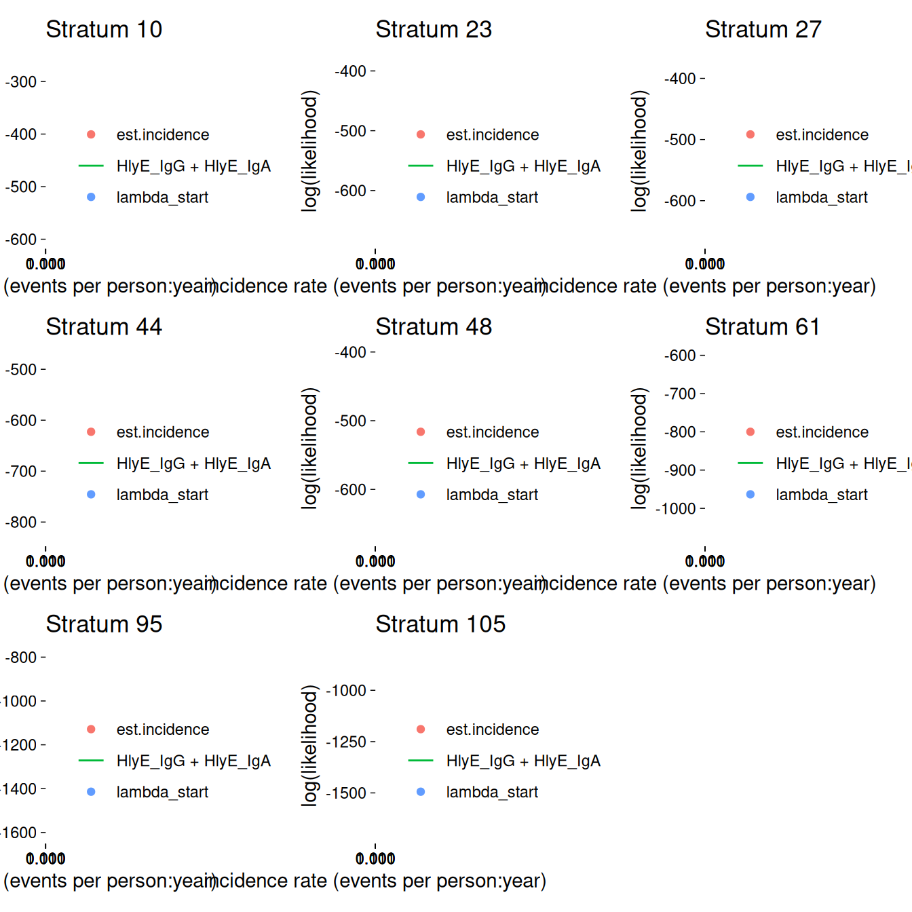

# Simulation studies

This vignette shows how to simulate a cross-sectional sample of
seroresponses for incident infections as a Poisson process with
frequency `lambda`. Responses are generated for the antibodies given in
the `antigen_isos` argument.

Age range of the simulated cross-sectional record is `lifespan`.

The size of the sample is `nrep`.

Each individual is simulated separately, but different antibodies are
modelled jointly.

Longitudinal parameters are calculated for an age: `age_fixed` (fixed
age). However, when `age_fixed` is set to NA then the age at infection
is used.

The boolean `renew_params` determines whether each infection uses a new
set of longitudinal parameters, sampled at random from the posterior
predictive output of the longitudinal model. If set to `FALSE`, a
parameter set is chosen at birth and kept, but:

1.  the baseline antibody levels (`y0`) are updated with the simulated
    level (just) prior to infection, and

2.  when `age_fixed = NA`, the selected parameter sample is updated for
    the age when infection occurs.

For our initial simulations, we will set `renew_params = FALSE`:

``` r
renew_params <- FALSE
```

There is also a variable `n_mcmc_samples`: when `n_mcmc_samples==0` then
a random MC sample is chosen out of the posterior set (1:4000). When
`n_mcmc_samples` is given a value in 1:4000, the chosen number is fixed
and reused in any subsequent infection. This is for diagnostic purposes.

## Simulate a single dataset

### load model parameters

Here we load in longitudinal parameters; these are modeled from all SEES
cases across all ages and countries:

``` r
library(serocalculator)
library(tidyverse)
#> ── Attaching core tidyverse packages ──────────────────────── tidyverse 2.0.0 ──
#> ✔ dplyr     1.1.4     ✔ readr     2.1.6
#> ✔ forcats   1.0.1     ✔ stringr   1.6.0
#> ✔ ggplot2   4.0.1     ✔ tibble    3.3.1
#> ✔ lubridate 1.9.4     ✔ tidyr     1.3.2
#> ✔ purrr     1.2.1     
#> ── Conflicts ────────────────────────────────────────── tidyverse_conflicts() ──
#> ✖ dplyr::filter() masks stats::filter()
#> ✖ dplyr::lag()    masks stats::lag()
#> ℹ Use the conflicted package (<http://conflicted.r-lib.org/>) to force all conflicts to become errors
library(ggbeeswarm) # for plotting
library(dplyr)
dmcmc <-
  "https://osf.io/download/rtw5k" |>
  load_sr_params() |>
  dplyr::filter(iter < 50) # reduce number of mcmc samples for speed
```

### visualize antibody decay model

We can graph individual MCMC samples from the posterior distribution of
model parameters using a
[`autoplot.curve_params()`](https://ucd-serg.github.io/serocalculator/reference/autoplot.curve_params.md)
method for the
[`autoplot()`](https://ggplot2.tidyverse.org/reference/autoplot.html)
function:

``` r
dmcmc |> autoplot(show_quantiles = FALSE, n_curves = 100)
```


We can use a logarithmic scale for the x-axis if desired:

``` r
dmcmc |> autoplot(show_quantiles = FALSE, log_x = TRUE, n_curves = 100)
```


We can add the median, 10%, and 90% quantiles of the model:

``` r
# Specify the antibody-isotype responses to include in analyses
antibodies <- c("HlyE_IgA", "HlyE_IgG")

dmcmc |>
  autoplot(show_quantiles = TRUE, n_curves = 100)
```


### Simulate cross-sectional data

``` r
# set seed to reproduce results
set.seed(54321)

# simulated incidence rate per person-year
lambda <- 0.2
# range covered in simulations
lifespan <- c(0, 10)
# cross-sectional sample size
nrep <- 100

# biologic noise distribution
dlims <- rbind(
  "HlyE_IgA" = c(min = 0, max = 0.5),
  "HlyE_IgG" = c(min = 0, max = 0.5)
)
```

``` r

verbose <- FALSE # whether to print verbose updates as the function runs

# generate cross-sectional data
csdata <- sim_pop_data(
  curve_params = dmcmc,
  lambda = lambda,
  n_samples = nrep,
  age_range = lifespan,
  antigen_isos = antibodies,
  n_mcmc_samples = 0,
  renew_params = renew_params,
  add_noise = TRUE,
  noise_limits = dlims,
  format = "long"
)
```

### Noise parameters

We need to provide noise parameters for the analysis; here, we define
them directly in our code:

``` r
library(tibble)
cond <- tibble(
  antigen_iso = c("HlyE_IgG", "HlyE_IgA"),
  nu = c(0.5, 0.5), # Biologic noise (nu)
  eps = c(0, 0), # M noise (eps)
  y.low = c(1, 1), # low cutoff (llod)
  y.high = c(5e6, 5e6)
) # high cutoff (y.high)
```

### Visualize data

We can plot the distribution of the antibody responses in the simulated
data.

``` r
csdata |>
  ggplot() +
  aes(x = as.factor(antigen_iso),
      y = value) +
  geom_beeswarm(
    size = .5,
    alpha = .5,
    aes(color = antigen_iso),
    show.legend = FALSE
  ) +
  geom_boxplot(outlier.colour = NA, fill = NA) +
  scale_y_log10() +
  theme_linedraw() +
  labs(x = "antigen - isotype")
```


### calculate log-likelihood

We can calculate the log-likelihood of the data as a function of the
incidence rate directly:

``` r
ll_a <-
  log_likelihood(
    pop_data = csdata,
    curve_params = dmcmc,
    noise_params = cond,
    antigen_isos = "HlyE_IgA",
    lambda = 0.1
  ) |>
  print()
#> [1] -292.5068

ll_g <-
  log_likelihood(
    pop_data = csdata,
    curve_params = dmcmc,
    noise_params = cond,
    antigen_isos = "HlyE_IgG",
    lambda = 0.1
  ) |>
  print()
#> [1] -329.1799

ll_ag <-
  log_likelihood(
    pop_data = csdata,
    curve_params = dmcmc,
    noise_params = cond,
    antigen_isos = c("HlyE_IgG", "HlyE_IgA"),
    lambda = 0.1
  ) |>
  print()
#> [1] -621.6867

print(ll_a + ll_g)
#> [1] -621.6867
```

### graph log-likelihood

We can also graph the log-likelihoods, even without finding the MLEs,
using
[`graph_loglik()`](https://ucd-serg.github.io/serocalculator/reference/graph_loglik.md):

``` r
lik_HlyE_IgA <-
  graph_loglik(
    pop_data = csdata,
    curve_params = dmcmc,
    noise_params = cond,
    antigen_isos = "HlyE_IgA",
    log_x = TRUE
  )

lik_HlyE_IgG <- graph_loglik(
  previous_plot = lik_HlyE_IgA,
  pop_data = csdata,
  curve_params = dmcmc,
  noise_params = cond,
  antigen_isos = "HlyE_IgG",
  log_x = TRUE
)

lik_both <- graph_loglik(
  previous_plot = lik_HlyE_IgG,
  pop_data = csdata,
  curve_params = dmcmc,
  noise_params = cond,
  antigen_isos = c("HlyE_IgG", "HlyE_IgA"),
  log_x = TRUE
)

print(lik_both)
```


### estimate incidence

We can estimate incidence with
[`est_seroincidence()`](https://ucd-serg.github.io/serocalculator/reference/est_seroincidence.md):

``` r
est1 <- est_seroincidence(
  pop_data = csdata,
  sr_params = dmcmc,
  noise_params = cond,
  lambda_start = .1,
  build_graph = TRUE,
  verbose = verbose,
  print_graph = FALSE, # display the log-likelihood curve while
  #`est_seroincidence()` is running
  antigen_isos = antibodies
)
```

We can extract summary statistics with
[`summary()`](https://rdrr.io/r/base/summary.html):

``` r
summary(est1)
#> # A tibble: 1 × 11
#>   est.start incidence.rate     SE CI.lwr CI.upr se_type  coverage log.lik
#>       <dbl>          <dbl>  <dbl>  <dbl>  <dbl> <chr>       <dbl>   <dbl>
#> 1       0.1          0.279 0.0289  0.228  0.342 standard     0.95   -584.
#> # ℹ 3 more variables: iterations <int>, antigen.isos <chr>,
#> #   nlm.convergence.code <ord>
```

We can plot the log-likelihood curve with
[`autoplot()`](https://ggplot2.tidyverse.org/reference/autoplot.html):

``` r
autoplot(est1)
```


We can set the x-axis to a logarithmic scale:

``` r
autoplot(est1, log_x = TRUE)
```


## Simulate multiple clusters with different lambdas

``` r
library(parallel)
n_cores <- max(1, parallel::detectCores() - 1)
print(n_cores)
#> [1] 3
```

In the preceding code chunk, we have determined that we can use 3 CPU
cores to run computations in parallel.

``` r
# number of clusters
nclus <- 20
# cross-sectional sample size
nrep <- 100

# incidence rate in e
lambdas <- c(.05, .1, .15, .2, .5, .8)

sim_df <-
  sim_pop_data_multi(
    n_cores = n_cores,
    lambdas = lambdas,
    nclus = nclus,
    sample_sizes = nrep,
    age_range = lifespan,
    antigen_isos = antibodies,
    renew_params = renew_params,
    add_noise = TRUE,
    curve_params = dmcmc,
    noise_limits = dlims,
    format = "long"
  )

print(sim_df)
#> # A tibble: 24,000 × 7
#>      age id    antigen_iso value lambda.sim sample_size cluster
#>    <dbl> <chr> <chr>       <dbl>      <dbl>       <dbl>   <int>
#>  1  3.53 1     HlyE_IgA    0.725       0.05         100       1
#>  2  3.53 1     HlyE_IgG    0.749       0.05         100       1
#>  3  2.27 2     HlyE_IgA    0.647       0.05         100       1
#>  4  2.27 2     HlyE_IgG    0.382       0.05         100       1
#>  5  9.05 3     HlyE_IgA    0.176       0.05         100       1
#>  6  9.05 3     HlyE_IgG    0.585       0.05         100       1
#>  7  5.94 4     HlyE_IgA    0.845       0.05         100       1
#>  8  5.94 4     HlyE_IgG    0.744       0.05         100       1
#>  9  9.88 5     HlyE_IgA    0.644       0.05         100       1
#> 10  9.88 5     HlyE_IgG    0.292       0.05         100       1
#> # ℹ 23,990 more rows
```

We can plot the distributions of the simulated responses:

``` r
sim_df |>
  ggplot() +
  aes(
    x = as.factor(cluster),
    y = value
  ) +
  geom_beeswarm(size = .2, alpha = .3, aes(color = antigen_iso)) +
  geom_boxplot(outlier.colour = NA, fill = NA) +
  scale_y_log10() +
  facet_wrap(~ antigen_iso + lambda.sim, nrow = 2) +
  theme_linedraw()  +
  theme(legend.position = "bottom")
```


### Estimate incidence in each cluster

``` r
ests <-
  est_seroincidence_by(
    pop_data = sim_df,
    sr_params = dmcmc,
    noise_params = cond,
    num_cores = n_cores,
    strata = c("sample_size", "lambda.sim", "cluster"),
    curve_strata_varnames = NULL,
    noise_strata_varnames = NULL,
    verbose = verbose,
    build_graph = TRUE, # slows down the function substantially
    antigen_isos = c("HlyE_IgG", "HlyE_IgA")
  )
```

`summary(ests)` produces a
[`tibble()`](https://tibble.tidyverse.org/reference/tibble.html) with
some extra meta-data:

``` r
ests_summary <- ests |> summary() |> print()
#> Seroincidence estimated given the following setup:
#> a) Antigen isotypes   : HlyE_IgG, HlyE_IgA 
#> b) Strata       : sample_size, lambda.sim, cluster 
#> 
#>  Seroincidence estimates:
#> # A tibble: 120 × 16
#>    Stratum sample_size lambda.sim cluster     n est.start incidence.rate      SE
#>    <chr>         <dbl>      <dbl>   <int> <int>     <dbl>          <dbl>   <dbl>
#>  1 Stratu…         100       0.05       1   100       0.1         0.0853 0.0124 
#>  2 Stratu…         100       0.05       2   100       0.1         0.0480 0.00863
#>  3 Stratu…         100       0.05       3   100       0.1         0.0537 0.00899
#>  4 Stratu…         100       0.05       4   100       0.1         0.0432 0.00834
#>  5 Stratu…         100       0.05       5   100       0.1         0.0455 0.00824
#>  6 Stratu…         100       0.05       6   100       0.1         0.0630 0.0105 
#>  7 Stratu…         100       0.05       7   100       0.1         0.0622 0.0101 
#>  8 Stratu…         100       0.05       8   100       0.1         0.0470 0.00844
#>  9 Stratu…         100       0.05       9   100       0.1         0.0338 0.00722
#> 10 Stratu…         100       0.05      10   100       0.1         0.0714 0.0108 
#> # ℹ 110 more rows
#> # ℹ 8 more variables: CI.lwr <dbl>, CI.upr <dbl>, se_type <chr>,
#> #   coverage <dbl>, log.lik <dbl>, iterations <int>, antigen.isos <chr>,
#> #   nlm.convergence.code <ord>
```

We can explore the summary table interactively using
[`DT::datatable()`](https://rdrr.io/pkg/DT/man/datatable.html)

``` r
library(DT)
ests_summary |>
  DT::datatable(options = list(scrollX = TRUE)) |>
  DT::formatRound(
    columns = c(
      "incidence.rate",
      "SE",
      "CI.lwr",
      "CI.upr",
      "log.lik"
    )
  )
```

We can plot the likelihood for a single simulated cluster by subsetting
that simulation in `ests` and calling
[`plot()`](https://rdrr.io/r/graphics/plot.default.html):

``` r
autoplot(ests[1])
```


We can also plot log-likelihood curves for several clusters at once
(your computer might struggle to plot many at once):

``` r
autoplot(ests[1:5])
```


The `log_x` argument also works here:

``` r
autoplot(ests[1:5], log_x = TRUE)
```


#### `nlm()` convergence codes

Make sure to check the [`nlm()`](https://rdrr.io/r/stats/nlm.html) exit
codes (codes 3-5 indicate possible non-convergence):

``` r
ests_summary |>
  as_tibble() |> # removes extra meta-data
  select(Stratum, nlm.convergence.code) |>
  filter(nlm.convergence.code > 2)
#> # A tibble: 8 × 2
#>   Stratum     nlm.convergence.code
#>   <chr>       <ord>               
#> 1 Stratum 10  3                   
#> 2 Stratum 23  3                   
#> 3 Stratum 27  3                   
#> 4 Stratum 44  3                   
#> 5 Stratum 48  3                   
#> 6 Stratum 61  3                   
#> 7 Stratum 95  3                   
#> 8 Stratum 105 3
```

Solutions to [`nlm()`](https://rdrr.io/r/stats/nlm.html) exit codes 3-5:

- 3: decrease the `stepmin` argument to
  [`est_seroincidence()`](https://ucd-serg.github.io/serocalculator/reference/est_seroincidence.md)/[`est_seroincidence_by()`](https://ucd-serg.github.io/serocalculator/reference/est_seroincidence_by.md)
- 4: increase the `iterlim` argument to
  [`est_seroincidence()`](https://ucd-serg.github.io/serocalculator/reference/est_seroincidence.md)/[`est_seroincidence_by()`](https://ucd-serg.github.io/serocalculator/reference/est_seroincidence_by.md)
- 5: increase the `stepmax` argument to
  [`est_seroincidence()`](https://ucd-serg.github.io/serocalculator/reference/est_seroincidence.md)/[`est_seroincidence_by()`](https://ucd-serg.github.io/serocalculator/reference/est_seroincidence_by.md)

We can extract the indices of problematic strata, if there are any:

``` r
problem_strata <-
  which(ests_summary$nlm.convergence.code > 2) |>
  print()
#> [1]  10  23  27  44  48  61  95 105
```

If any clusters had problems, we can take a look:

``` r
if (length(problem_strata) > 0) {
  autoplot(ests[problem_strata], log_x = TRUE)
}
```



If any of the fits don’t appear to be at the maximum likelihood, we
should re-run those clusters, adjusting the
[`nlm()`](https://rdrr.io/r/stats/nlm.html) settings appropriately, to
be sure.

### plot distribution of estimates by simulated incidence rate

Finally, we can look at our simulation results:

``` r

library(ggplot2)
ests_summary |>
  autoplot(type = "scatter",
           xvar = "lambda.sim",
           CI = TRUE,
           dodge_width = .05) +
  ggplot2::geom_function(
    fun = function(x) x,
    col = "red",
    aes(linetype = "data-generating incidence rate")
  ) +
  labs(linetype = "") +
  scale_x_log10()
```


------------------------------------------------------------------------

We can analyze the simulation results with
[`analyze_sims()`](https://ucd-serg.github.io/serocalculator/reference/analyze_sims.md):

``` r
ests_summary |> analyze_sims()
#> # A tibble: 6 × 8
#>   lambda.sim sample_size     Bias Mean_Est_SE Empirical_SE   RMSE Mean_CI_Width
#>        <dbl>       <dbl>    <dbl>       <dbl>        <dbl>  <dbl>         <dbl>
#> 1       0.05         100 0.000864     0.00887       0.0158 0.0155        0.0355
#> 2       0.1          100 0.00486      0.0141        0.0137 0.0142        0.0559
#> 3       0.15         100 0.00142      0.0182        0.0240 0.0234        0.0720
#> 4       0.2          100 0.0228       0.0240        0.0350 0.0411        0.0949
#> 5       0.5          100 0.0749       0.0556        0.0831 0.110         0.219 
#> 6       0.8          100 0.166        0.0980        0.132  0.210         0.387 
#> # ℹ 1 more variable: CI_Coverage <dbl>
```

------------------------------------------------------------------------

We can graph the analysis results with an
[`autoplot()`](https://ggplot2.tidyverse.org/reference/autoplot.html)
method:

``` r

ests_summary |> analyze_sims() |> autoplot(statistic = "Empirical_SE")
#> `geom_line()`: Each group consists of only one observation.
#> ℹ Do you need to adjust the group aesthetic?
```


### Effect of `renew_params`

Setting `renew_params = TRUE` is more realistic, but not is accounted
for by the current method; for population samples from populations with
high incidence rates, there may be bias:

``` r
sim_df_renew <-
  sim_pop_data_multi(
    n_cores = n_cores,
    lambdas = lambdas,
    nclus = nclus,
    sample_sizes = nrep,
    age_range = lifespan,
    antigen_isos = antibodies,
    renew_params = TRUE,
    add_noise = TRUE,
    curve_params = dmcmc,
    noise_limits = dlims,
    format = "long"
  )

ests_renew <-
  est_seroincidence_by(
    pop_data = sim_df_renew,
    sr_params = dmcmc,
    noise_params = cond,
    num_cores = n_cores,
    strata = c("sample_size", "lambda.sim", "cluster"),
    curve_strata_varnames = NULL,
    noise_strata_varnames = NULL,
    verbose = verbose,
    build_graph = TRUE, # slows down the function substantially
    antigen_isos = c("HlyE_IgG", "HlyE_IgA")
  )
ests_renew_summary <-
  ests_renew |> summary()
```

``` r

ests_renew_summary |>
  autoplot(type = "scatter",
           xvar = "lambda.sim",
           CI = TRUE,
           dodge_width = .05) +
  ggplot2::geom_function(
    fun = function(x) x,
    col = "red",
    aes(linetype = "data-generating incidence rate")
  ) +
  labs(linetype = "") +
  scale_x_log10()
```


