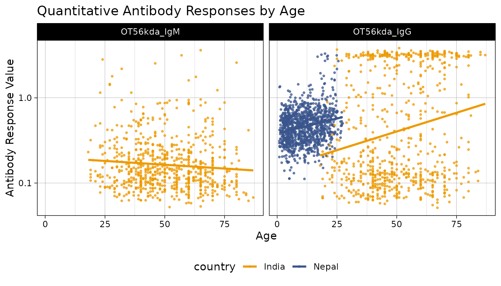

# Scrub Typhus Seroincidence Vignette

## Introduction

This vignette reproduces the analysis for: [**Estimating the
Seroincidence of Scrub Typhus using Antibody Dynamics after
Infection**](https://www.ajtmh.org/view/journals/tpmd/111/2/article-p267.xml)
(Aiemjoy et al. (2024)).

**Citation:** Aiemjoy, Kristen, Nishan Katuwal, Krista Vaidya, Sony
Shrestha, Melina Thapa, Peter Teunis, Isaac I. Bogoch et al. “Estimating
the Seroincidence of Scrub Typhus using Antibody Dynamics after
Infection.” The American Journal of Tropical Medicine and Hygiene 111,
no. 2 (2024): 267. <https://doi.org/10.4269/ajtmh.23-0475>

## Methods

The **serocalculator** R package provides a rapid and computationally
simple method for calculating seroconversion rates, as originally
published in Simonsen et al. (2009) and Teunis et al. (2012), and
further developed in subsequent publications by deGraaf et al. (2014),
Teunis et al. (2016), and Teunis and Eijkeren (2020). In short,
longitudinal seroresponses from confirmed cases with a known symptom
onset date are assumed to represent the time course of human serum
antibodies against a specific pathogen. Therefore, by using these
longitudinal antibody dynamics with any cross–sectional sample of the
same antibodies in a human population, an incidence estimate can be
calculated.

### The Seroincidence Estimator

The **serocalculator** package was designed to calculate the incidence
of seroconversion by using the longitudinal seroresponse
characteristics. The distribution of serum antibody concentrations in a
cross–sectional population sample is calculated as a function of the
longitudinal seroresponse and the frequency of seroconversion (or
seroincidence). Given the seroresponse, this marginal distribution of
antibody concentrations can be fitted to the cross-sectional data and
thereby providing a means to estimate the seroincidence.

## Scrub Typhus Seroincidence

Scrub typhus, a vector-borne bacterial infection, is an important but
neglected disease globally. Accurately characterizing burden is
challenging due to non-specific symptoms and limited diagnostics. Prior
seroepidemiology studies have struggled to find consensus cutoffs that
permit comparing estimates across contexts and time. In this study, we
present a novel approach that does not require a cutoff and instead uses
information about antibody kinetics after infection to estimate
seroincidence. We use data from three cohorts of scrub typhus patients
in Chiang Rai, Thailand, and Vellore, India to characterize antibody
kinetics after infection and two population serosurveys in the Kathmandu
valley, Nepal, and Tamil Nadu, India to estimate seroincidence. The
samples were tested for IgM and IgG responses to Orientia
tsutsugamushi-derived recombinant 56-kDa antigen using commercial ELISA
kits. These antigens (OT56kdaIgG and OT56kdaIgM) represent IgG and IgM
responses to a 56 kilodalton antigen on the membrane of *Orientia
tsutsugamushi* (OT) that have been found to be specific to this organism
and are used in diagnosis. We used with-host Bayesian hierarchical
models to characterize antibody responses after scrub typhus infection
and used the joint distributions of the peak antibody titers and decay
rates to estimate population-level incidence rates in the
cross-sectional serosurveys.

### Load packages

The first step in conducting this analysis is to load our necessary
packages. If you haven’t installed already, you will need to do so
before loading. We will also need to have the `tidyverse` and `mixtools`
packages installed for data manipulation and graphics operations we will
perform in this vignette. Please see the websites for
[`serocalculator`](https://ucd-serg.github.io/serocalculator/#installing-the-serocalculator-package),
[`tidyverse`](https://tidyverse.tidyverse.org/#installation), and
[`mixtools`](https://github.com/dsy109/mixtools?tab=readme-ov-file#installation)
for guidance on installing these packages into your R package library.

Once all three of those packages are installed, we can load them into
our active R session environment:

``` r
library(serocalculator)
library(tidyverse)
library(mixtools)
```

### Load data

Pathogen-specific sample datasets, noise parameters, and longitudinal
antibody dynamics for **serocalculator** are available on the
[Serocalculator Repository](https://osf.io/ne8pc/) on Open Science
Framework (OSF). We will pull this data directly into our R environment.

#### Load and prepare longitudinal parameter data

We will first load the longitudinal curve parameters to set the antibody
decay parameters. These parameters were modeled with Bayesian
hierarchical models to fit two-phase power-function decay models to the
longitudinal antibody responses among confirmed enteric fever cases.

``` r
# Import longitudinal antibody parameters from OSF

curves <-
  "https://osf.io/download/u5gxh/" |> 
  load_sr_params()
#> Warning: `data` is missing `iter` column
#> It will be inferred from row ordering.
```

#### Visualize curve parameters

We can graph the decay curves with an
[`autoplot()`](https://ggplot2.tidyverse.org/reference/autoplot.html)
method:

``` r
# Visualize curve parameters with custom colors
curves |> autoplot() 
```


#### Load and prepare cross-sectional data

Next, we load our sample cross-sectional data.

``` r
# Import cross-sectional data from OSF and rename required variables
xs_data <- load_pop_data(
  file_path = "https://osf.io/download/h5js4/",
  age = "Age",
  value = "result",
  id = "index_id",
  standardize = TRUE
)
```

#### Check formatting

We can check that `xs_data` has the correct formatting using the
[`check_pop_data()`](https://ucd-serg.github.io/serocalculator/reference/check_pop_data.md)
function:

``` r
xs_data |> check_pop_data(verbose = TRUE)
#> data format is as expected.
```

#### Summarize antibody data

We can compute numerical summaries of our cross-sectional antibody data
with a [`summary()`](https://rdrr.io/r/base/summary.html) method for
`pop_data` objects:

``` r
xs_data |> summary(strata = "country")
#> Warning: There were 2 warnings in `dplyr::summarize()`.
#> The first warning was:
#> ℹ In argument: `across(...)`.
#> ℹ In group 4: `antigen_iso = OT56kda_IgM` `country = Nepal`.
#> Caused by warning in `min()`:
#> ! no non-missing arguments to min; returning Inf
#> ℹ Run `dplyr::last_dplyr_warnings()` to see the 1 remaining warning.
#> 
#> n = 1608 
#> 
#> Distribution of age: 
#> 
#> # A tibble: 2 × 8
#>   country     n   min first_quartile median  mean third_quartile   max
#>   <fct>   <int> <dbl>          <dbl>  <dbl> <dbl>          <dbl> <dbl>
#> 1 India     721  18             40     49    50.5           62    87  
#> 2 Nepal     887   0.9            5.5   10.9  11.6           17.0  27.4
#> 
#> Distributions of antigen-isotype measurements:
#> 
#> # A tibble: 4 × 8
#>   antigen_iso country     Min `1st Qu.` Median `3rd Qu.`     Max `# NAs`
#>   <fct>       <fct>     <dbl>     <dbl>  <dbl>     <dbl>   <dbl>   <int>
#> 1 OT56kda_IgG India     0.05      0.111  0.222     2.56     3.81       0
#> 2 OT56kda_IgM India     0.051     0.1    0.139     0.229    3.60       0
#> 3 OT56kda_IgG Nepal     0.112     0.335  0.464     0.602    3.29       0
#> 4 OT56kda_IgM Nepal   Inf        NA     NA        NA     -Inf       1105
```

#### Visualize antibody data

Let’s also take a look at how antibody responses change by age.

``` r
# Plot antibody responses by age with custom colors
autoplot(object = xs_data, type = "age-scatter", strata = "country") +
  scale_color_manual(values = c("India" = "orange2", "Nepal" = "#39558CFF")) 
#> Warning: Removed 1105 rows containing missing values or values outside the scale range
#> (`geom_point()`).
```



As is clear from these data, the study in Nepal was performed in
children, while the study in India was performed in adults, yet we can
see that the values were higher on average and with less variation in
Nepal.

### Compile noise parameters

Next, we must set conditions based on some assumptions about the data
and errors that may need to be accounted for. This will differ based on
background knowledge of the data.

The biological noise, $\nu$ (“nu”), represents error from
cross-reactivity to other antibodies. Measurement noise, $\varepsilon$
(“epsilon”), represents error from the laboratory testing process.

*Formatting Specifications*: Noise parameter data should be a dataframe
with one row for each antigen isotype and columns for each noise
parameter below.

| Column Name | Description                                    |
|-------------|------------------------------------------------|
| y.low       | Lower limit of detection of the antibody assay |
| nu          | Biologic noise                                 |
| y.high      | Upper limit of detection of the antibody assay |
| eps         | Measurement noise                              |

*Note that variable names are case-sensitive.*

``` r
# Biologic noise calculation
# Note: There was an error in the SD calculation in the original paper.
# The correct approach is to use the sigma value directly from the mixture model,
# not sqrt(sigma). This vignette uses the corrected calculation.

set.seed(1234)


b_noise <- xs_data |>
  filter(!is.na(value)) |>
  group_by(antigen_iso) |>
  group_modify(~{
    mixmod <- mixtools::normalmixEM(.x$value, k = 2, maxit = 1000)
    
    lower_k <- which.min(mixmod$mu)   # pick the lower-mean component
    lower_mu <- mixmod$mu[lower_k]
    lower_sd <- mixmod$sigma[lower_k] 
    
    tibble::tibble(
      percentile95 = qnorm(0.95, mean = lower_mu, sd = lower_sd)
    )
  }) |>
  ungroup()
#> number of iterations= 37 
#> number of iterations= 31

# Biologic noise calculation (using children age <2 with lower liklihood of prior exposure)
b_noise_u5 <- xs_data |>
  filter(!is.na(value), age <5) |>
  group_by(antigen_iso) |>
  group_modify(~{
    mixmod <- mixtools::normalmixEM(.x$value, k = 2, maxit = 1000)
    
    lower_k <- which.min(mixmod$mu)   # pick the lower-mean component
    lower_mu <- mixmod$mu[lower_k]
    lower_sd <- mixmod$sigma[lower_k] 
    
    tibble::tibble(
      percentile95 = qnorm(0.95, mean = lower_mu, sd = lower_sd)
    )
  }) |>
  ungroup()
#> number of iterations= 89


# Define conditional parameters
noise <- data.frame(
  antigen_iso = c("OT56kda_IgG", "OT56kda_IgM"),
  nu = as.numeric(c(b_noise[2, 2], b_noise[1, 2])), # Biologic noise (nu)
  nu_u5 = as.numeric(c(b_noise_u5[1, 2], b_noise_u5[2, 2])), # Biologic noise (nu)
  eps = c(0.2, 0.2), # M noise (eps)
  y.low = c(0.2, 0.2), # low cutoff (llod)
  y.high = c(4, 4)
) |> # high cutoff (y.high)
  mutate(across(where(is.numeric), round, digits = 2))
```

The table below shows the noise parameters that will be used in the
serocalculator function:

``` r
# Display noise parameters table
knitr::kable(noise, 
             caption = "Noise parameters for scrub typhus seroincidence estimation",
             col.names = c("Antigen-Isotype", "Biological Noise (ν)", "Biological Noise (ν), children < 5",
                          "Measurement Noise (ε)", "Lower Limit", "Upper Limit"))
```

| Antigen-Isotype | Biological Noise (ν) | Biological Noise (ν), children \< 5 | Measurement Noise (ε) | Lower Limit | Upper Limit |
|:----------------|---------------------:|------------------------------------:|----------------------:|------------:|------------:|
| OT56kda_IgG     |                 0.77 |                                0.41 |                   0.2 |         0.2 |           4 |
| OT56kda_IgM     |                 0.24 |                                  NA |                   0.2 |         0.2 |           4 |

Noise parameters for scrub typhus seroincidence estimation

## Estimate Seroincidence by study site

Now we are ready to begin estimating seroincidence using IgG responsed
to 56kda. We will use `est.incidence.by` to calculate stratified
seroincidence rates.

``` r
# Using est.incidence.by (strata)

est <- est_seroincidence_by(
  strata = c("country"),
  pop_data = xs_data,
  sr_params = curves,
  noise_params = noise,
  antigen_isos = c("OT56kda_IgG"),
  num_cores = 8 # Allow for parallel processing to decrease run time
)
#> Warning: `curve_params` is missing all strata variables and will be used unstratified.
#> ℹ To avoid this warning, specify the desired set of stratifying variables in
#>   the `curve_strata_varnames` and `noise_strata_varnames` arguments to
#>   `est_seroincidence_by()`.
#> Warning: `noise_params` is missing all strata variables and will be used unstratified.
#> ℹ To avoid this warning, specify the desired set of stratifying variables in
#>   the `curve_strata_varnames` and `noise_strata_varnames` arguments to
#>   `est_seroincidence_by()`.

summary(est)
#> Seroincidence estimated given the following setup:
#> a) Antigen isotypes   : OT56kda_IgG 
#> b) Strata       : country 
#> 
#>  Seroincidence estimates:
#> # A tibble: 2 × 13
#>   Stratum   country     n est.start incidence.rate       SE  CI.lwr  CI.upr
#>   <chr>     <fct>   <int>     <dbl>          <dbl>    <dbl>   <dbl>   <dbl>
#> 1 Stratum 1 India     721       0.1        0.0199  0.00146  0.0173  0.0230 
#> 2 Stratum 2 Nepal    1105       0.1        0.00749 0.000984 0.00579 0.00969
#> # ℹ 5 more variables: coverage <dbl>, log.lik <dbl>, iterations <int>,
#> #   antigen.isos <chr>, nlm.convergence.code <ord>
```

### Compare seroincidence rates between countries

We can use the
[`compare_seroincidence()`](https://ucd-serg.github.io/serocalculator/reference/compare_seroincidence.md)
function to perform statistical comparisons between countries and
generate a nicely formatted table with p-values:

``` r
# Compare seroincidence rates between countries
comparison <- compare_seroincidence(est)

# Display comparison table
knitr::kable(comparison,
             digits = 4,
             caption = "Statistical comparison of seroincidence rates between countries")
```

| Stratum_1 | Stratum_2 | country.1 | country.2 | incidence.rate.1 | incidence.rate.2 | difference |     SE | z.statistic | p.value | CI.lwr | CI.upr |
|:----------|:----------|:----------|:----------|-----------------:|-----------------:|-----------:|-------:|------------:|--------:|-------:|-------:|
| Stratum 1 | Stratum 2 | India     | Nepal     |           0.0199 |           0.0075 |     0.0124 | 0.0018 |      7.0499 |       0 |  0.009 | 0.0159 |

Statistical comparison of seroincidence rates between countries

## Estimate Seroincidence by study site and age strata

Now we are ready to begin estimating seroincidence. We will use
`est.incidence.by` to calculate stratified seroincidence rates.

``` r
# Using est.incidence.by (strata)

est2 <- est_seroincidence_by(
  strata = c("country", "ageQ"),
  pop_data = xs_data,
  sr_params = curves,
  noise_params = noise,
  antigen_isos = c("OT56kda_IgG"),
  num_cores = 8 # Allow for parallel processing to decrease run time
)
#> Warning: Some strata are completely missing one or more biomarkers.
#> , , antigen_iso = OT56kda_IgM
#> 
#>        ageQ
#> country 0-17 18-29 30-49 50-89
#>   India    0    59   302   360
#>   Nepal  876   229     0     0
#> 
#> , , antigen_iso = OT56kda_IgG
#> 
#>        ageQ
#> country 0-17 18-29 30-49 50-89
#>   India    0    59   302   360
#>   Nepal  876   229     0     0
#> Warning: `curve_params` is missing all strata variables and will be used unstratified.
#> ℹ To avoid this warning, specify the desired set of stratifying variables in
#>   the `curve_strata_varnames` and `noise_strata_varnames` arguments to
#>   `est_seroincidence_by()`.
#> Warning: `noise_params` is missing all strata variables and will be used unstratified.
#> ℹ To avoid this warning, specify the desired set of stratifying variables in
#>   the `curve_strata_varnames` and `noise_strata_varnames` arguments to
#>   `est_seroincidence_by()`.

summary(est2)
#> Seroincidence estimated given the following setup:
#> a) Antigen isotypes   : OT56kda_IgG 
#> b) Strata       : country, ageQ 
#> 
#>  Seroincidence estimates:
#> # A tibble: 5 × 14
#>   Stratum   country ageQ      n est.start incidence.rate      SE  CI.lwr  CI.upr
#>   <chr>     <fct>   <fct> <int>     <dbl>          <dbl>   <dbl>   <dbl>   <dbl>
#> 1 Stratum 1 India   18-29    59       0.1        0.00879 3.15e-3 0.00436 0.0177 
#> 2 Stratum 2 India   30-49   302       0.1        0.0150  1.77e-3 0.0119  0.0189 
#> 3 Stratum 3 India   50-89   360       0.1        0.0284  2.86e-3 0.0233  0.0346 
#> 4 Stratum 4 Nepal   0-17    876       0.1        0.00491 9.53e-4 0.00335 0.00718
#> 5 Stratum 5 Nepal   18-29   229       0.1        0.0136  2.47e-3 0.00949 0.0194 
#> # ℹ 5 more variables: coverage <dbl>, log.lik <dbl>, iterations <int>,
#> #   antigen.isos <chr>, nlm.convergence.code <ord>
```

### Compare seroincidence rates between age groups and countries

``` r
# Compare all pairs of strata
comparison2 <- compare_seroincidence(est2)

# Display comparison table
knitr::kable(comparison2,
             digits = 4,
             caption = "Statistical comparisons of seroincidence rates between strata")
```

| Stratum_1 | Stratum_2 | country.1 | ageQ.1 | country.2 | ageQ.2 | incidence.rate.1 | incidence.rate.2 | difference |     SE | z.statistic | p.value |  CI.lwr |  CI.upr |
|:----------|:----------|:----------|:-------|:----------|:-------|-----------------:|-----------------:|-----------:|-------:|------------:|--------:|--------:|--------:|
| Stratum 1 | Stratum 2 | India     | 18-29  | India     | 30-49  |           0.0088 |           0.0150 |    -0.0062 | 0.0036 |     -1.7199 |  0.0855 | -0.0133 |  0.0009 |
| Stratum 1 | Stratum 3 | India     | 18-29  | India     | 50-89  |           0.0088 |           0.0284 |    -0.0196 | 0.0043 |     -4.5992 |  0.0000 | -0.0279 | -0.0112 |
| Stratum 1 | Stratum 4 | India     | 18-29  | Nepal     | 0-17   |           0.0088 |           0.0049 |     0.0039 | 0.0033 |      1.1810 |  0.2376 | -0.0026 |  0.0103 |
| Stratum 1 | Stratum 5 | India     | 18-29  | Nepal     | 18-29  |           0.0088 |           0.0136 |    -0.0048 | 0.0040 |     -1.1935 |  0.2327 | -0.0126 |  0.0031 |
| Stratum 2 | Stratum 3 | India     | 30-49  | India     | 50-89  |           0.0150 |           0.0284 |    -0.0134 | 0.0034 |     -3.9705 |  0.0001 | -0.0200 | -0.0068 |
| Stratum 2 | Stratum 4 | India     | 30-49  | Nepal     | 0-17   |           0.0150 |           0.0049 |     0.0101 | 0.0020 |      5.0253 |  0.0000 |  0.0062 |  0.0140 |
| Stratum 2 | Stratum 5 | India     | 30-49  | Nepal     | 18-29  |           0.0150 |           0.0136 |     0.0014 | 0.0030 |      0.4714 |  0.6373 | -0.0045 |  0.0074 |
| Stratum 3 | Stratum 4 | India     | 50-89  | Nepal     | 0-17   |           0.0284 |           0.0049 |     0.0235 | 0.0030 |      7.7697 |  0.0000 |  0.0175 |  0.0294 |
| Stratum 3 | Stratum 5 | India     | 50-89  | Nepal     | 18-29  |           0.0284 |           0.0136 |     0.0148 | 0.0038 |      3.9113 |  0.0001 |  0.0074 |  0.0222 |
| Stratum 4 | Stratum 5 | Nepal     | 0-17   | Nepal     | 18-29  |           0.0049 |           0.0136 |    -0.0087 | 0.0026 |     -3.2696 |  0.0011 | -0.0138 | -0.0035 |

Statistical comparisons of seroincidence rates between strata

Finally, let’s summarize and visualize seroincidence rates by strata.

``` r
# Plot seroincidence estimates

# Save summary(est) as a dataframe
estdf <- summary(est) |>
  mutate(ageQ = "Overall")

# Save summary(est2) as a dataframe
est2df <- summary(est2)


est_comb <- rbind(estdf, est2df)

### Summary table with seroincidence rates and 95% CIs
summary_table <- est_comb |>
  mutate(
    `Seroincidence Rate` = sprintf("%.1f", incidence.rate*1000),
    `95% CI` = sprintf("[%.1f, %.1f]", CI.lwr*1000, CI.upr*1000),
    `Age Group` = ageQ
    #`Standard Error` = sprintf("%.4f", SE)
  ) %>%
  arrange(ageQ) %>%
  select(country, `Age Group`, `Seroincidence Rate`, `95% CI`)

knitr::kable(summary_table,
             caption = "Scrub typhus seroincidence rates by country, per 1000 person-years")
```

| country | Age Group | Seroincidence Rate | 95% CI         |
|:--------|:----------|:-------------------|:---------------|
| Nepal   | 0-17      | 4.9                | \[3.4, 7.2\]   |
| India   | 18-29     | 8.8                | \[4.4, 17.7\]  |
| Nepal   | 18-29     | 13.6               | \[9.5, 19.4\]  |
| India   | 30-49     | 15.0               | \[11.9, 18.9\] |
| India   | 50-89     | 28.4               | \[23.3, 34.6\] |
| India   | Overall   | 19.9               | \[17.3, 23.0\] |
| Nepal   | Overall   | 7.5                | \[5.8, 9.7\]   |

Scrub typhus seroincidence rates by country, per 1000 person-years

``` r


# Create barplot (rescale incidence rate and CIs)
ggplot(est_comb, aes(y = ageQ, x = incidence.rate * 1000, fill = country)) +
  geom_bar(
    stat = "identity",
    position = position_dodge2(width = 0.8, preserve = "single")
  ) +
  geom_linerange(aes(xmin = CI.lwr * 1000, xmax = CI.upr * 1000),
                 position = position_dodge2(width = 0.8, preserve = "single")) +
  labs(title = "Scrub Typhus Seroincidence by Country",
       x = "Seroincidence rate per 1000 person-years",
       y = "Age Group") +
  theme_bw() +
  facet_wrap(~ country) +
  theme(axis.text.y = element_text(size = 11),
        axis.text.x = element_text(size = 11)) +
  scale_fill_manual(values = c("India" = "orange2", "Nepal" = "#39558CFF"))
```


## Acknowledgments

We gratefully acknowledge the study participants for their valuable time
and interest in participating in these studies

## Funding

This work was supported by the National Institutes of Health Fogarty
International Center (FIC) at \[K01 TW012177\] and the National
Institute of Allergy and Infectious Diseases (NIAID) \[R21 1AI176416\]

## References

Aiemjoy, Kristen, Nishan Katuwal, Krista Vaidya, Sony Shrestha, Melina
Thapa, Peter Teunis, Isaac I Bogoch, et al. 2024. “Estimating the
Seroincidence of Scrub Typhus Using Antibody Dynamics After Infection.”
*The American Journal of Tropical Medicine and Hygiene* 111 (2): 267.
<https://doi.org/10.4269/ajtmh.23-0475>.

deGraaf, W. F., M. E. E. Kretzschmar, P. F. M. Teunis, and O. Diekmann.
2014. “A Two-Phase Within-Host Model for Immune Response and Its
Application to Serological Profiles of Pertussis.” *Epidemics* 9
(December): 1–7. <https://doi.org/10.1016/j.epidem.2014.08.002>.

Simonsen, J., K. Mølbak, G. Falkenhorst, K. A. Krogfelt, A. Linneberg,
and P. F. M. Teunis. 2009. “Estimation of Incidences of Infectious
Diseases Based on Antibody Measurements.” *Statistics in Medicine* 28
(14): 1882–95. <https://doi.org/10.1002/sim.3592>.

Teunis, P. F. M., and J. C. H. van Eijkeren. 2020. “Estimation of
Seroconversion Rates for Infectious Diseases: Effects of Age and Noise.”
*Statistics in Medicine* 39 (21): 2799–2814.
<https://doi.org/10.1002/sim.8578>.

Teunis, P. F. M., J. C. H. van Eijkeren, W. F. de Graaf, A. Bonačić
Marinović, and M. E. E. Kretzschmar. 2016. “Linking the Seroresponse to
Infection to Within-Host Heterogeneity in Antibody Production.”
*Epidemics* 16 (September): 33–39.
<https://doi.org/10.1016/j.epidem.2016.04.001>.

Teunis, P. F. M., JCH van Eijkeren, CW Ang, YTHP van Duynhoven, JB
Simonsen, MA Strid, and W van Pelt. 2012. “Biomarker Dynamics:
Estimating Infection Rates from Serological Data.” *Statistics in
Medicine* 31 (20): 2240–48. <https://doi.org/10.1002/sim.5322>.
