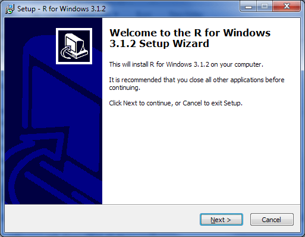
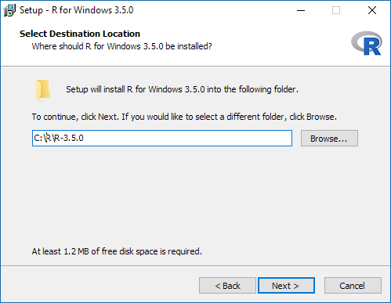
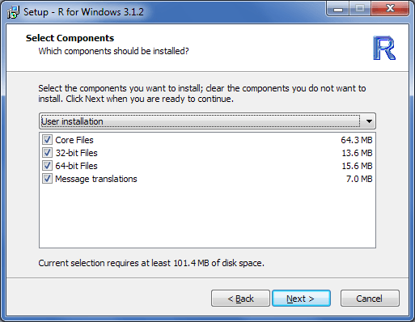
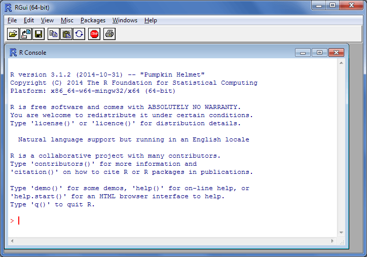

```{r, echo = FALSE}
# Grab package version and date from DESCRIPTION file.
pkgName = "serocalculator"
pkgVersion <- packageDescription(pkgName)$Version
pkgDate <- packageDescription(pkgName)$Date
pkgBaseFileName <- paste(pkgName, pkgVersion, sep = "_")
pkgUrl <- gsub("\n", "", packageDescription(pkgName)$URL)
pkgPath <- "http://ecdc.europa.eu/en/data-tools/seroincidence-calculator-tool/Documents"
library("knitr")
```

\newpage

# 1. Introduction

Package **`r pkgName`** is written in programming language R and end user must have access to a 
working installation of R engine. This document describes the most common setup with R installed 
locally on the user's computer. The screenshots refer to the classical R interface, but the package 
can also be opened in other Graphical User Interfaces fo R like e.g. 
[RStudio](http://www.rstudio.com/products/RStudio/).

# 2. Installation steps

R is a free software and can be downloaded from [http://cran.r-project.org/](http://cran.r-project.org/).
Latest version as of writing this document is **R 4.3.1**. Once the appropriate, operating system 
dependent, version is downloaded, install it on your computer following the standard procedure 
applicable to the operating system. For Windows the file to be downloaded is the so-called *base* 
distribution: [http://cran.r-project.org/bin/windows/base/](http://cran.r-project.org/bin/windows/base/).

## 2.1. Installing R

Start the R installer and follow the presented steps:

```{r echo=FALSE, fig.pos="!h", fig.align='center'}

```

It is advised to have R installed in folder that does not contain spaces, therefore please adjust 
the destination location accordingly:

```{r echo=FALSE, fig.pos="!h", fig.align='center'}

```

The **serocalculator** package is compatible with both the 32-bit and the 64-bit version of R. 
Choose the preferred platform (or both). If unsure install the 32-bit version only, however
on compatible platforms the 64-bit version may provide better performance:

```{r echo=FALSE, fig.pos="!h", fig.align='center'}

```

It is advised to select *Registry entries* in the next step for best experience:

```{r echo=FALSE, fig.pos="!h", fig.align='center'}
include_graphics("fig/setup4.png")
```

R interpreter, when installed on Windows, can be invoked from the start menu folder named **R**.

Start the preferred version of R (if both the 32-bit: *R i386* and the 64-bit: *x64* are installed).
Graphical user interface for R interpreter will start in a new window:

```{r echo=FALSE, fig.pos="!h", fig.align='center'}

```

## 2.2. Installing *serocalculator* package

Since this is a new installation of R, the **serocalculator** package must be installed before first use. As of 09/20/2023, **serocalculator** is still in development. To install the development version, you must install the **devtools** package and then download **serocalculator** from GitHub. 

```r
install.packages("devtools")
devtools::install_github("ucd-serg/serocalculator")
```

# 3. Post-installation

Successful installation can be confirmed by loading the package into the workspace 
and exploring help files and manuals distributed with the package:
```{r, eval=FALSE}
# Load package "seroincidence".
library(serocalculator)

# Show R help for the package.
?serocalculator

# Show tutorial for the package.
vignette(topic = "tutorial", package = "serocalculator")
```

Additionally, most package details can be found when executing the following commands:
```{r}
# Show description.
packageDescription("serocalculator")

# Show citation.
citation("serocalculator")
```
