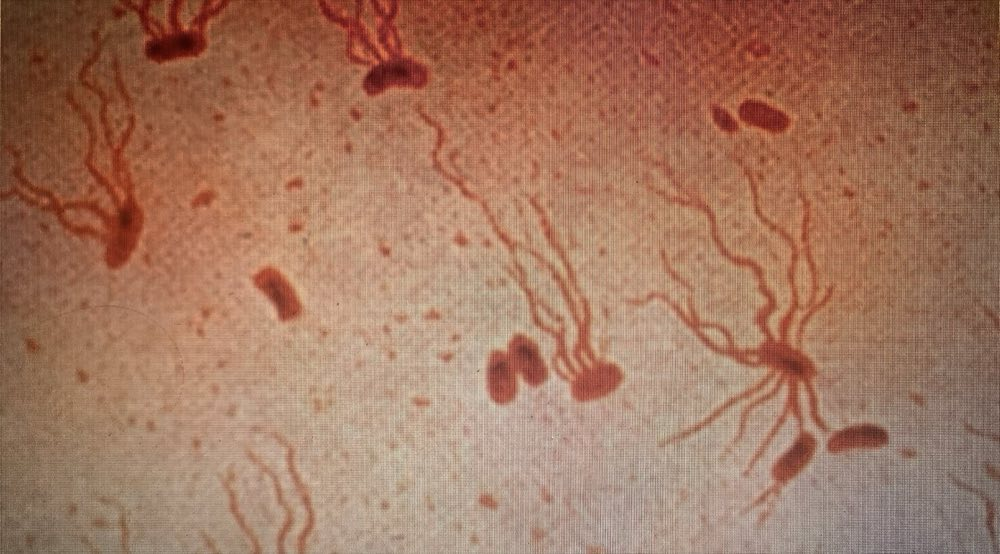
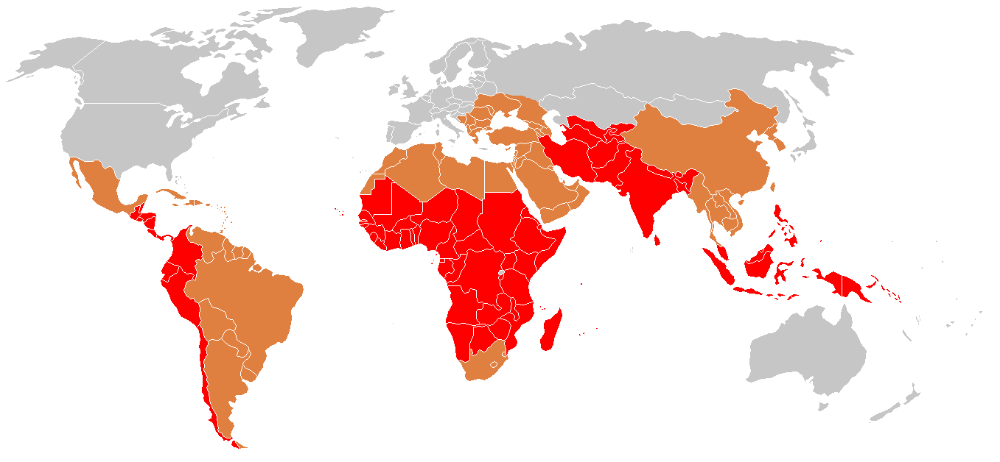
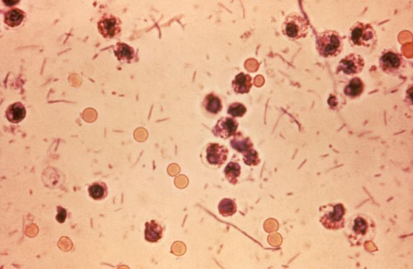
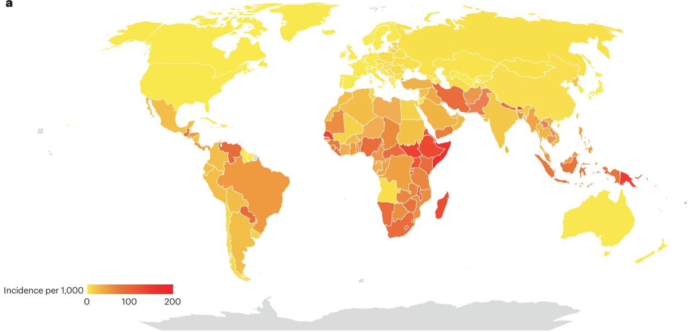
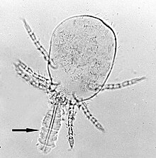
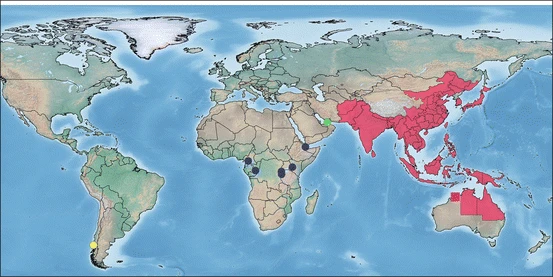
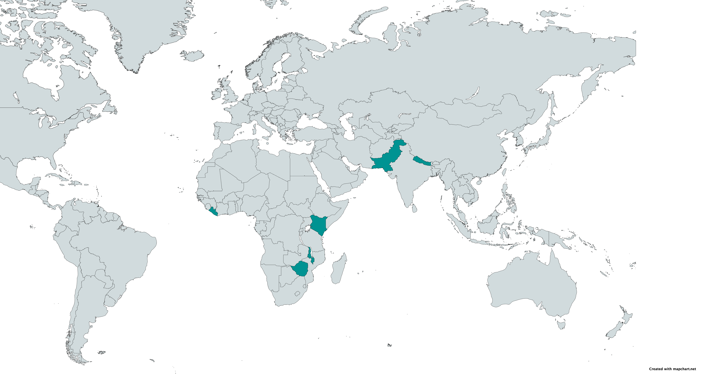
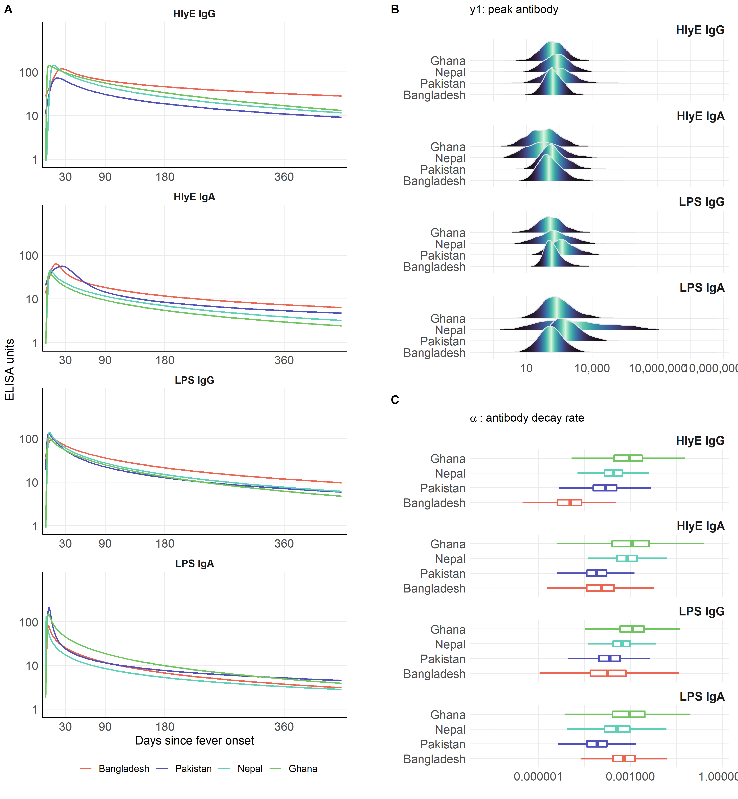
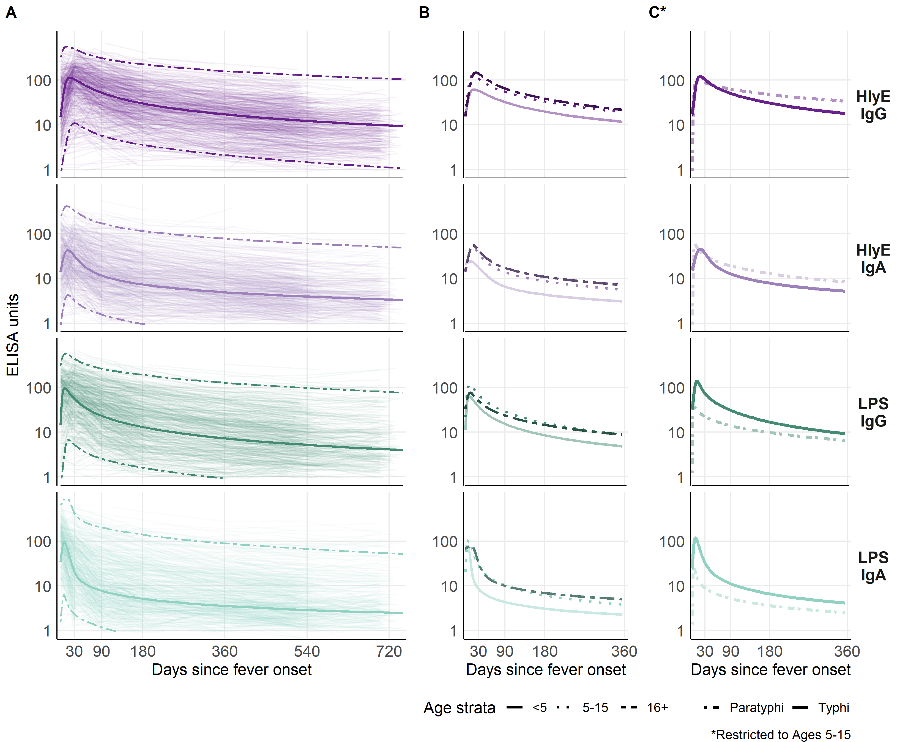
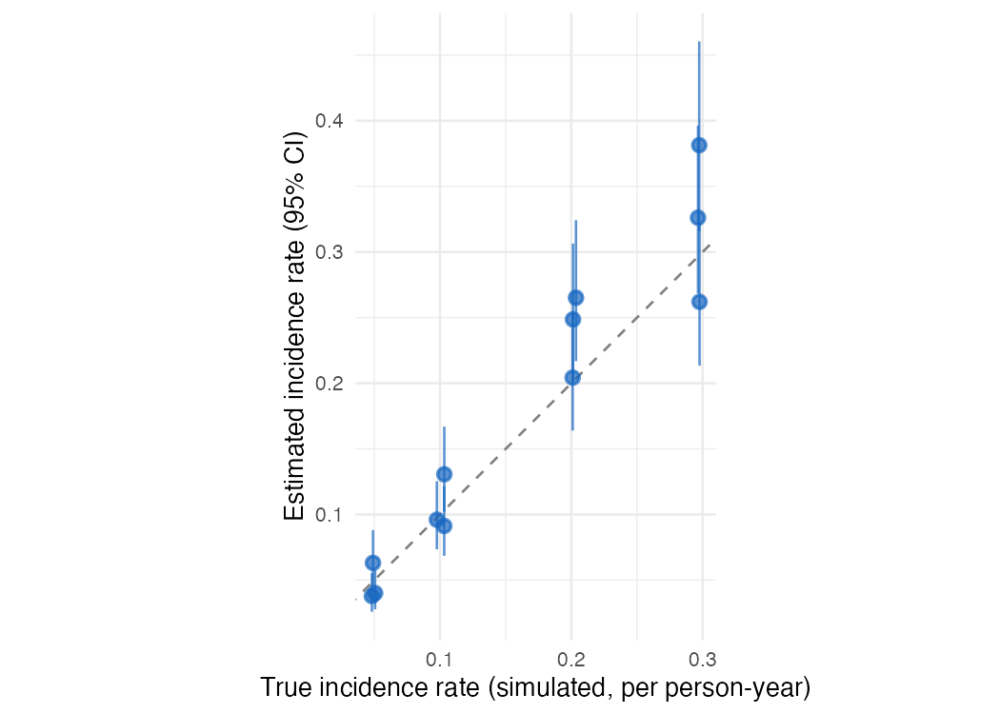



# Infectious disease epidemiology

## *Salmonella* enterica ("typhoid fever")

::: {.columns}

::: {.column width="60%"}

* ~21.7 million symptomatic cases/year
* ~217,000 deaths/year (~1% case fatality with treatment; up to 20% untreated)
* Highest burden: ages 5–19
* **Symptoms:** sustained high fever, severe headache, abdominal pain, malaise; rose-spot rash (~30% of patients); constipation (early) or diarrhea (later)

:::

::: {.column width="40%"}
{fig-alt="Photomicrograph of *Salmonella* Typhi bacteria with a flagellar stain"}
{fig-alt="Historical illustration depicting typhoid fever"}

:::

:::

## *Shigella* ("dysentery")

::: {.columns}

:::: {.column width="50%"}

  * ~100 million infections annually
  * ~100,000 deaths annually (~1% case fatality; higher in malnourished children)
  * Most cases and deaths: children under 5 in low- and middle-income countries (LMICs)
  * **Symptoms:** bloody diarrhea (dysentery), abdominal cramps, fever, tenesmus (painful urge to defecate)
     
::::

:::: {.column width="50%"}

{fig-alt="Microscopy of a stool sample containing *Shigella* bacteria"}
{fig-alt="Published figure on enteric pathogen epidemiology from Nature Reviews Microbiology (2024)"}
::::

:::

## *Orientia tsutsugamushi* ("scrub typhus")

::: {.columns}

:::: {.column width="50%"}

  * ~1,000,000 infections/year
  * ~10,000 deaths/year (~1% case fatality with treatment; up to 30% untreated)
  * **Symptoms:** high fever, severe headache, myalgia; eschar (pathognomonic black scab at mite-bite site); macular rash; cough; gastrointestinal symptoms; hemorrhage in severe cases


::::

:::: {.column width="50%"}

{fig-alt="Microscopy of a *Trombicula* mite larva with its stylostome feeding tube"}
{fig-alt="Published figure on scrub typhus from a Springer book chapter"}
::::

:::

# Why estimate incidence from serosurveys?

## The burden-data gap {.smaller}

::: {.columns}

:::: {.column width="55%"}

* Typhoid conjugate vaccines (TCVs) are **80-90% effective** and
WHO-recommended since 2018, but **few countries** have adopted them into
routine immunization.

* A major barrier is the **lack of burden data**: most low- and
middle-income countries lack robust typhoid surveillance and have little
or no incidence data.

* These gaps block applications for vaccine funding,
widening **equity gaps** in access to effective vaccines.

::::

:::: {.column width="45%"}

{fig-alt="Figure summarizing global typhoid burden and the limited adoption of typhoid conjugate vaccines"}

::::

:::

::: notes
Three large randomized trials showed that a Vi tetanus-toxoid typhoid
conjugate vaccine is 80-90% effective at preventing symptomatic typhoid,
and the WHO has recommended these vaccines since 2018. Yet as of 2023 only
a handful of countries had introduced them into routine immunization. The
binding constraint is data: without incidence estimates, countries cannot
make the case for vaccine funding.

"Data inequality is our biggest challenge moving forward" --- Kathy Neuzil, 2023
:::



## Seroepidemiology can fill the gap

The Seroepidemiology and Environmental Surveillance for Enteric Fever
(SEES) study collected cross-sectional serosurveys across multiple
countries to estimate typhoid incidence from antibody data
[@Aiemjoy_2022_Lancet].

::: notes
This lecture describes the methodology behind that kind of estimate: how a
single cross-sectional serosurvey, combined with a model of antibody
dynamics, can recover an incidence rate.
:::

## Defining incidence

::: {#def-incidence}

#### Population incidence rate

The **incidence rate** of a disease over a **specific time period** is 
the rate at which individuals in a population are *acquiring* the disease 
during that time period [@Noordzij2010diseasemeasures].
:::



::: {#exm-incidence-rate}

#### Population incidence rate

If there are **10 new cases** of typhoid 
in a population of **1000 persons** 
during a **one month** time period, 
then the **incidence rate** for that time period is
**10 new cases per 1000 persons per month**.
:::

## Mathematical definition of incidence

More precisely, the incidence rate at time $t$ is the **rate of new
infections per person at risk**:

$$\lambda_t = \frac{1}{N(t)}\,\frac{d}{dt}\,\mathbb{E}[C(t)]$$

where $C(t)$ is the cumulative number of infections and $N(t)$ the number of
individuals at risk at time $t$.

## Scale of incidence rates

In both definitions, 
the units for an incidence rate are 
"# new infections per # persons at risk per time duration"; 
for example, "new infections per 1000 persons per year". 

For convenience, 
we can rescale the incidence rate to make it easier to understand; 
for example, we might express incidence as 
"# new infections per 1000 persons per year" 
or "# new infections per 100,000 persons per day", etc.

## Incidence from an individual's perspective

From the perspective of an individual in the population:

* the **incidence rate** (at a given time point $t$)
is the instantaneous **probability density** of
**becoming infected** at that time point,
**given** that they are **at risk** at that time point.

* That is, the incidence rate is a **hazard** rate.

* Notation: let's use **$\lambda_{t}$** to denote the incidence rate at time $t$.

# Study designs for estimating incidence rates

## Longitudinal cohort studies

Incidence rates can be estimated from longitudinal cohort studies,
but cohort studies are:

- costly to conduct
- slow to produce results, 
- vulnerable to selection and censoring (drop-out) biases

## Clinical case data

Incidence rates can also be estimated from clinical case rates,
but clinical case rates undercount:

- asymptomatic cases
- symptomatic cases who don't receive clinical care.

## Cross-sectional serosurveys

::: notes

Alternatively, incidence rates can be estimated from biomarker data
collected through a single cross-sectional survey, 
combined with a longitudinal model of 
how those biomarkers respond to infection over time.
Compared with cohort studies and clinical case rates,
cross-sectional incidence estimation can 
produce estimates that are:
:::

- accurate
- timely
- cost-efficient

See @HAY2024100806 for overview

# Estimating incidence from cross-sectional serosurveys

## Goal

> Easily and reproducibly translate **quantitative antibody responses**
> at the population level into meaningful and accurate **epidemiological
> measures of infection burden**.

## Antibody responses are complicated {.incremental}

Using antibody levels to recover infection times is hard, because antibody
responses:

::: incremental

* **decay over time** after infection
* **vary from individual to individual** (age, immune function, prior
infections, vaccination)
* **vary from measurement to measurement** (assay noise)
* can **cross-react** with antibodies from other exposures

:::

::: notes
Each of these complications has to be handled somewhere in the model:
waning, between-person heterogeneity, measurement error, and
cross-reactivity. The rest of this section builds that model up piece by
piece.
:::

## Cross-sectional antibody surveys {.incremental}

::: notes
Typically, it is difficult to estimate changes from a single time point. 
However, we can sometimes make assumptions that allow us to do so. 
In particular, if we assume that the incidence rate is constant over time, 
then we can estimate incidence from a single cross-sectional survey.

We will need two pieces of notation to formalize this process.

:::

::: incremental

* We recruit participants from the population of interest.

* For each survey participant, we measure antibody levels $(Y)$ 
for the disease of interest

* Each participant was **most recently infected** at some time $(T)$
**prior** to when we measured their antibodies.

::: notes
* If a participant has never been infected since birth, then $T$ is undefined.


:::

* $T$ is a **latent, unobserved variable**.

::: notes
* We **don't directly observe $T$**; we **only observe $Y$**, 
which we hope tells us something about $T$ and $\lambda$.

:::

:::

## Modeling assumptions

We **assume** that:

::: incremental

* The incidence rate is approximately **constant** 
**over time** and **across the population** ("**constant and homogenous incidence**")

::: notes

* that is:
$$\lambda_{i,t} = \lambda, \forall i,t$$

(We can analyze subpopulations separately to make homogeneity more plausible.)
:::

* Participants are always at risk of a new infection, 
regardless of how recently they have been infected
("**no lasting immunity**").

:::

::: notes
(For diseases like typhoid, 
the no-immunity assumption may not hold exactly,
but hopefully approximately; 
modeling the effects of re-exposure during an active infection is 
[on our to-do list](https://github.com/UCD-SERG/serodynamics/issues/11)).
:::

## Time since infection and incidence {.smaller}

Under those assumptions:

. . .

* $T$ has an **exponential distribution**:

. . . 

$$\pdf(T=t) =  \red{\lambda\expf{-\lambda t}}$$

. . .

  * More precisely, the distribution is exponential 
  **truncated by age** at observation ($a$):

. . .

$$
\pdf(T=t|A=a) = 1_{t \in[0,a]} \red{\lambda \expf{-\lambda t}} + 
1_{t = \NA} \expf{-\lambda a}
$$

. . .

* the rate parameter $\lambda$ is the incidence rate

::: notes
This is a time-to-event model, 
looking **backwards in time** from the survey date 
(when the blood sample was collected).

The probability that 
an individual was **last** infected $t$ days ago, $p(T=t)$, 
is equal to the probability of being infected at time $t$ 
(i.e., the incidence rate at time $t$, $\lambda$) 
times the probability of not being infected after time $t$, 
which turns out to be $\exp(-\lambda t)$.

The distribution of $T$ is truncated by the patient's birth date;
the probability that they have never been infected is
$\expf{-\lambda a}$, 
where $a$ is the patient's age at the time of the survey.
:::

## Likelihood of latent infection times {.smaller}



## Example log-likelihood curves

::: notes
Here's what that would look like:
:::

```{r}
#| fig-cap: "log-likelihood curve for latent data"
#| label: fig-ex-lik-curves
library(serodynamics)
library(serocalculator)
library(dplyr)
antibodies <- c("HlyE_IgA", "HlyE_IgG")
set.seed(1)

sim_case_data <-
  serocalculator::typhoid_curves_nostrat_100 |>
  sim_case_data(n = 5, 
                antigen_isos = antibodies,
                max_n_obs = 20, followup_interval = 14)

t1 <- sim_case_data$timeindays
loglik0 <- function(lambda) {
  sum(
    dexp(t1, rate = lambda, log = TRUE)
  )
}
loglik1 <- Vectorize(loglik0, vectorize.args = "lambda")

library(ggplot2)

ggplot() + 
  geom_function(fun = loglik1) +
  xlim(0, .1) +
  theme_bw() +
  xlab("lambda") +
  ylab("log-likelihood")

```

```{r}
#| include: false
# Import longitudinal antibody parameters from OSF
curves <-
  "https://osf.io/download/rtw5k/" |>
  load_sr_params() |>
  filter(iter < 50) |>
  filter(antigen_iso %in% antibodies)

# Import cross-sectional data from OSF and rename required variables:
xs_data <-
  "https://osf.io/download/n6cp3/" |>
  load_pop_data()

noise <- url("https://osf.io/download/hqy4v/") |> readRDS()
```

## Standard errors

The standard error of the estimate is approximately equal to
the inverse of the curvature (2nd derivative, aka Hessian)
of the log-likelihood function, at the maximum:

more curvature $\rightarrow$
a sharper likelihood peak $\rightarrow$
smaller standard errors

## Hessian for the exponential model {.smaller}

For the latent-time exponential model, the log-likelihood is
$$\llik^*(\lambda) = n\logf{\lambda} - \lambda\sum_{i=1}^n t_i$$

so the score and the Hessian (here a scalar second derivative) are

$$
\llik^{*\prime}(\lambda) = \frac{n}{\lambda} - \sum_{i=1}^n t_i,
\qquad
\llik^{*\prime\prime}(\lambda) = -\frac{n}{\lambda^2}
$$

::: notes
The observed information is
$\mathcal{I}(\lambda) = -\llik^{*\prime\prime}(\lambda) = n/\lambda^2$.
:::

Evaluated at the MLE $\hat\lambda = 1/\bar t$, the variance and standard
error are

$$
\widehat{\operatorname{Var}}(\hat\lambda) \approx
\left[-\llik^{*\prime\prime}(\hat\lambda)\right]^{-1} = \frac{\hat\lambda^2}{n},
\qquad
\operatorname{SE}(\hat\lambda) \approx \frac{\hat\lambda}{\sqrt{n}}
$$

::: notes
So more curvature (larger $n/\lambda^2$) means a sharper peak and a smaller
standard error, consistent with the previous slide.
:::

## Likelihood of observed data

::: notes
Unfortunately, we don't observe infection times $T$; 
we only observe antibody levels ${Y}$. 
So things get a little more complicated.

In short, we are hoping that we can estimate 
$T$ (time since last infection) 
from $Y$ (current antibody levels). 
If we could do that, 
then we could plug in our estimates $\hat t_i$ 
into that likelihood above, 
and estimate $\lambda$ as previously.

We're actually going to do something a little more nuanced; 
instead of just using one value for $\hat t$, 
we are going to consider all possible values of $t$ for each individual.

We need to link the data we actually observed to the incidence rate.

The likelihood of an individual's observed data, 
$\pdf(Y=y)$, 
can be expressed as an integral over 
the joint likelihood of $Y$ and $T$ 
(using the Law of Total Probability):
:::

::: incremental

* $$\pdf(Y=y) = \int_t \pdf(Y=y,T=t)dt$$

:::: notes
Further, we can express the joint probability $p(Y=y,T=t)$ as the product of 
$p(T=t)$ and 
$p(Y=y|T=t)$ the "antibody response curve after infection". 
That is:
::::

* $$\pdf(Y=y,T=t) = \pdf(Y=y|T=t) \pdf(T=t)$$

:::

## Antibody response curves

::: {#fig-sim-case-data}
```{r}

sim_case_data |>
  autoplot(alpha = .5)

```

Antibody response curves, $p(Y=y|T=t)$, for typhoid

:::



::: {#fig-decay}

```{r}
case_data <-
    serodynamics_example(
      "SEES_Case_Nepal_ForSeroKinetics_02-13-2025.csv"
    ) |>
    readr::read_csv() |>
    dplyr::mutate(
      .by = person_id,
      visit_num = dplyr::row_number()
    ) |>
    as_case_data(
      id_var = "person_id",
      biomarker_var = "antigen_iso",
      value_var = "result",
      time_in_days = "dayssincefeveronset"
    )

most_obs <-
  case_data |>
  count(id) |> 
  arrange(desc(n)) |> 
  head(10)
  
case_data |> 
  semi_join(most_obs, by = "id") |> 
    autoplot(alpha = .5, log_x = FALSE)
```

Observed antibody measurements over time since fever onset, for typhoid

:::

## The per-person likelihood

Substituting $p(Y=y,T=t) = p(Y=y|T=t)\,p(T=t)$
into the previous expression for $p(Y=y)$:

$$
\begin{aligned}
p(Y=y)
&= \int_t p(Y=y|T=t)\,p(T=t)\, dt
\end{aligned}
$$

## The full-sample likelihood {.smaller}

::: notes
Now, the likelihood of the observed data 
$\vec{y} = (y_1, y_2, ..., y_n)$ is:
:::

$$
\begin{aligned}
\mathcal{L}(\lambda) 
&= \prod_{i=1}^n p(Y=y_i)
\\&= \prod_{i=1}^n \int_t p(Y=y_i|T=t)p_\lambda(T=t)dt\\
\end{aligned}
$$

::: notes
If we know $p(Y=y|T=t)$, then we can maximize $\mathcal{L}(\lambda)$ over $\lambda$ to find the "maximum likelihood estimate" (MLE) of $\lambda$, denoted $\hat\lambda$.
:::

## Finding the MLE numerically

::: notes
The likelihood of $Y$ involves the product of integrals, so the log-likelihood involves the sum of the logs of integrals:
:::

$$
\begin{aligned}
\log \mathcal{L} (\lambda) 
&= \log \prod_{i=1}^n \int_t p(Y=y_i|T=t)p_\lambda(T=t)dt\\
&= \sum_{i=1}^n \log\left\{\int_t p(Y=y_i|T=t)p_\lambda(T=t)dt\right\}\\
\end{aligned}
$$

::: notes

The derivative of this expression doesn't come out cleanly, 
so we will use a *numerical method* 
(specifically, a Newton-type algorithm, 
implemented by `stats::nlm()`) 
to find the MLE and corresponding standard error.

:::

## Cluster-robust standard errors for clustered sampling designs





<!--  -->

## Multiple biomarkers

```{r}
#| fig-cap: "Example log(likelihood) curves"
#| label: fig-loglik
lik_HlyE_IgA <- graph_loglik( # nolint: object_name_linter.
  pop_data = xs_data,
  curve_params = curves,
  noise_params = noise,
  antigen_isos = "HlyE_IgA",
  log_x = TRUE
)

lik_HlyE_IgG <- graph_loglik( # nolint: object_name_linter.
  previous_plot = lik_HlyE_IgA,
  pop_data = xs_data,
  curve_params = curves,
  noise_params = noise,
  antigen_isos = "HlyE_IgG",
  log_x = TRUE
)

lik_both <- graph_loglik(
  previous_plot = lik_HlyE_IgG,
  pop_data = xs_data,
  curve_params = curves,
  noise_params = noise,
  antigen_isos = c("HlyE_IgG", "HlyE_IgA"),
  log_x = TRUE
)

print(lik_both)
```

## Variation in antibody kinetics: by country {.smaller}

Antibody-decay kinetics are not identical across populations. Estimated
seroresponse parameters vary by **country**, **age**, and **serotype**
(*Typhi* vs *Paratyphi* A).

{fig-alt="Antibody decay curves and distributions of peak level and decay rate, stratified by country, for four antigen-isotypes"}

## Variation in antibody kinetics: by age and serotype {.smaller}

{fig-alt="Antibody decay curves stratified by age group and by Typhi versus Paratyphi A serotype, for four antigen-isotypes"}

::: notes
This heterogeneity is why we stratify the analysis (for example by country
and age group) and why extending the model to handle covariates directly
is on the roadmap.
:::

# Estimating the curves with `serodynamics`

## Where do the curve parameters come from?

The decay curves above are themselves **estimated** from longitudinal
antibody measurements on **confirmed cases** --- individuals with a known
infection date who are sampled repeatedly afterward. Fitting the two-phase
model to those data yields, for each antigen-isotype, the parameters the
incidence model needs:

* baseline antibody level ($y_0$)
* peak concentration ($y_1$)
* time to peak ($t_1$)
* decay rate ($\alpha$)
* decay shape ($r$)

## The `serodynamics` package {.smaller}

[`serodynamics`](https://github.com/UCD-SERG/serodynamics) is an
open-source R package that fits this two-phase within-host kinetics model
with a **Bayesian hierarchical** model, sampled by MCMC (via JAGS). The
hierarchical structure stabilizes individual-level estimates by borrowing
strength across participants --- valuable when longitudinal data are sparse.

::: notes
The same modeling framework has been applied to pertussis, typhoid, scrub
typhus, and *Shigella*. Previously each application re-implemented the JAGS
model specification, data formatting, and post-processing by hand;
`serodynamics` packages that into a single reusable, validated workflow.
:::

## A typical `serodynamics` workflow {.smaller}

```{r}
#| eval: false
library(serodynamics)

# Longitudinal confirmed-case data (example data ships with the package)
data("nepal_sees")

# Fit the two-phase model by MCMC (JAGS); slow, so not run here
fit <- run_mod(data = nepal_sees, with_post = TRUE)

# Check convergence, then export serocalculator-ready curve parameters
plot_jags_Rhat(fit)
curve_params <- postprocess_jags_output(fit)
```

::: notes
`run_mod()` runs several MCMC chains for tens of thousands of iterations,
so a real fit takes minutes to hours; the package ships ready-made example
output (`nepal_sees_jags_output`) for experimentation.
:::

## What a fitted model looks like {.smaller}

The package ships a cached example fit; `plot_jags_dens()` shows the
posterior densities of the five kinetic parameters (here HlyE IgG, *Typhi*),
overlaid by MCMC chain:

::: notes
The overlapping chains indicate good convergence.
:::

```{r}
#| eval: false
data("nepal_sees_jags_output")
plot_jags_dens(nepal_sees_jags_output, iso = "HlyE_IgG", strat = "typhi")
```

{fig-alt="Five posterior density panels (alpha, shape, t1, y0, y1) with two overlapping MCMC chains"}

## Two packages, one pipeline

* **`serodynamics`** (upstream): longitudinal **confirmed-case** data
$\rightarrow$ estimated antibody-decay **curve parameters**
* **`serocalculator`** (downstream): a **cross-sectional serosurvey** plus
those curve parameters $\rightarrow$ a **seroincidence** estimate

The output of `serodynamics` feeds directly into `serocalculator`'s
`est_seroincidence_by()`.

## Propagating uncertainty and heterogeneity {.smaller}

The seroresponse model $\pdf(Y=y|T=t)$ is **not a single fixed curve**.
`serodynamics` returns a posterior **sample** of curve-parameter sets
$\theta^{(1)},\dots,\theta^{(M)}$ (each $\theta^{(k)} = (y_0, y_1, t_1, \alpha, r)^{(k)}$),
which together capture both

::: incremental

* **estimation uncertainty** in the kinetics parameters, and
* **between-person / between-case heterogeneity** in the seroresponse.

:::

::: notes
Each draw is one plausible antibody-response curve; together they describe
the distribution of responses across cases and our uncertainty about it.
:::



The incidence likelihood **averages over these draws** (Monte Carlo
integration), so each person's contribution becomes

$$
\pdf(Y=y) \approx \frac{1}{M}\sum_{k=1}^{M}
\int_t \pdf(Y=y|T=t, \theta^{(k)})\; \pdf_\lambda(T=t)\, dt
$$

::: notes
Because the curve-parameter distribution is marginalized into the likelihood
this way, the resulting $\hat\lambda$ and its standard error reflect the
seroresponse heterogeneity and the parameter uncertainty --- they are not
conditional on a single point-estimated curve. In `serocalculator` this is
the average over the Monte Carlo parameter sets (the `iter` draws) carried in
the curve-parameter object.
:::

# Using `serocalculator`

## An open-source R package

The methods in this lecture are implemented in the open-source
[`serocalculator`](https://github.com/UCD-SERG/serocalculator) R package.

```{r}
#| eval: false
library(serocalculator)

# Load antibody-decay curve parameters and cross-sectional population data
curves <- "https://osf.io/download/rtw5k/" |> load_sr_params()
xs_data <- "https://osf.io/download/n6cp3/" |> load_pop_data()
noise <- url("https://osf.io/download/hqy4v/") |> readRDS()

# Visualize the cross-sectional antibody distribution
xs_data |> autoplot(strata = "Country", type = "density")
```

## Estimating seroincidence {.smaller}

```{r}
#| eval: false
# Estimate incidence, stratified by country and age group
est <- est_seroincidence_by(
  pop_data = xs_data,
  sr_params = curves,
  noise_params = noise,
  strata = c("Country", "ageCat"),
  antigen_isos = c("HlyE_IgG", "HlyE_IgA")
)

summary(est)
```

## Interactive Shiny app

::: {.columns}

:::: {.column width="60%"}

A point-and-click interface is available at
<https://ucdserg.shinyapps.io/shiny_serocalculator/>.

::::

:::: {.column width="40%"}

{fig-alt="Screenshot of the serocalculator Shiny web application"}

::::

:::

# Validation: recovering known incidence rates

## Simulating clusters with known incidence {.smaller}

We can check the method by **simulating** cross-sectional serosurveys with
**known** incidence rates and seeing whether the estimates recover them.
`sim_pop_data_multi()` simulates several clusters, each at a specified true
rate $\lambda$:

```{r}
#| eval: false
library(serocalculator)

antibodies <- c("HlyE_IgA", "HlyE_IgG")

# Noise settings follow serocalculator's `simulate_xsectionalData` vignette,
# where the estimation noise is kept consistent with the simulated noise.
# Assay-noise parameters for estimation:
noise_params <- tibble::tibble(
  antigen_iso = antibodies,
  nu = 0.5, eps = 0, y.low = 1, y.high = 5e6
)

# Biologic-noise limits for the simulation (vignette `dlims`):
noise_limits <- rbind(
  HlyE_IgA = c(min = 0, max = 0.5),
  HlyE_IgG = c(min = 0, max = 0.5)
)

# Simulate clusters at a range of true incidence rates
sim_df <- sim_pop_data_multi(
  curve_params = typhoid_curves_nostrat_100,
  lambdas = c(0.05, 0.1, 0.2, 0.3), # true incidence rates
  nclus = 3, # clusters per rate
  sample_sizes = 100,
  age_range = c(0, 10),
  antigen_isos = antibodies,
  add_noise = TRUE,
  noise_limits = noise_limits,
  format = "long"
)

# Estimate incidence separately in each simulated cluster
ests <- est_seroincidence_by(
  pop_data = sim_df,
  sr_params = typhoid_curves_nostrat_100,
  noise_params = noise_params,
  strata = c("lambda.sim", "cluster"),
  antigen_isos = antibodies
)
summary(ests)
```

## Estimates recover the simulated rates {.smaller}

{fig-alt="Estimated versus true incidence rate for simulated clusters; points with 95% confidence intervals scatter around the identity line, with wider intervals at higher rates"}

::: notes
Each point is one simulated cluster: the estimated incidence rate (with its
95% confidence interval) against the true rate used to generate the data.
The estimates scatter around the identity line, and the intervals are wider
at higher incidence. Abridged from the serocalculator
`simulate_xsectionalData` vignette.
:::

## In-progress work

* Extending and improving existing Shiny apps for these methods
  (e.g., the [serocalculator Shiny app](https://ucdserg.shinyapps.io/shiny_serocalculator/),
  [source](https://github.com/UCD-SERG/shiny_serocalculator))

* Multivariate modeling of biomarkers (relaxing conditional independence)

* A graphical (Shiny) app for `serodynamics`

* Modeling time-varying incidence rates

* Accounting for re-exposure

* Accounting for latent immunocompromised subpopulations

* Calibrating to population demographics

## Multiple biomarkers: beyond conditional independence {.smaller}

With several biomarkers (e.g. HlyE IgA and IgG), the current method treats
them as **conditionally independent given the time since infection**, so the
joint likelihood factors into a product of per-biomarker terms:

$$
\pdf(Y_1 = y_1, Y_2 = y_2 \mid T=t) =
\pdf(Y_1 = y_1 \mid T=t)\,\pdf(Y_2 = y_2 \mid T=t)
$$

::: notes
This is the same conditional-independence simplification that naive Bayes
makes (features independent given the class): convenient, but it ignores any
within-person correlation between biomarkers.
:::

. . .

Kwan Ho Lee (UCD-SERG) is relaxing this to allow **covariance** among
biomarkers --- a multivariate seroresponse model with a Kronecker-structured
covariance, fit in Stan
([UCD-SERG/shigella#13](https://github.com/UCD-SERG/shigella/pull/13)).

## References {.smaller .unnumbered}

::: {#refs}
:::
