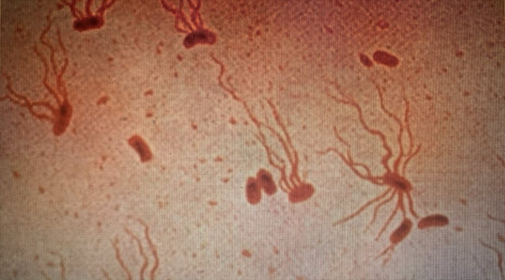
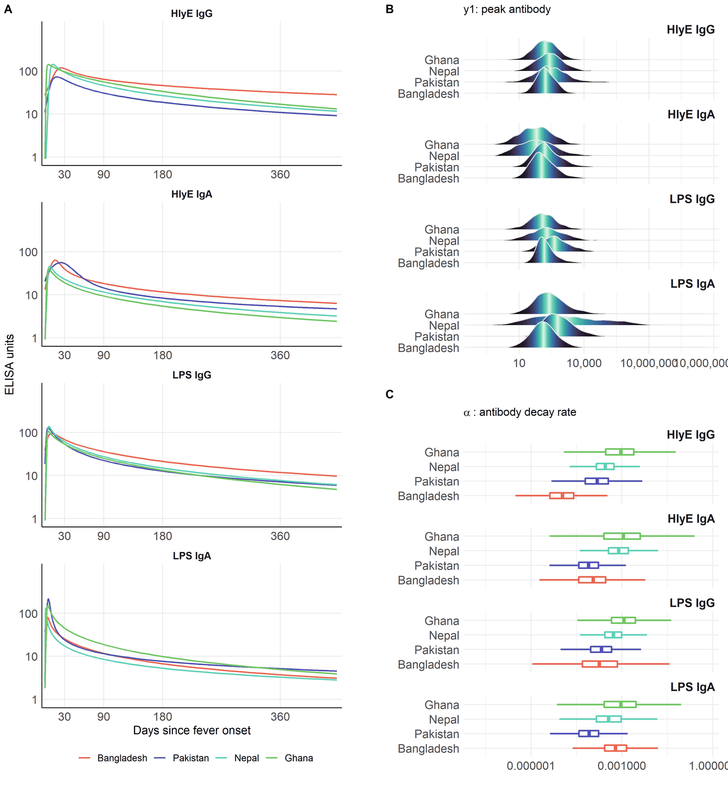
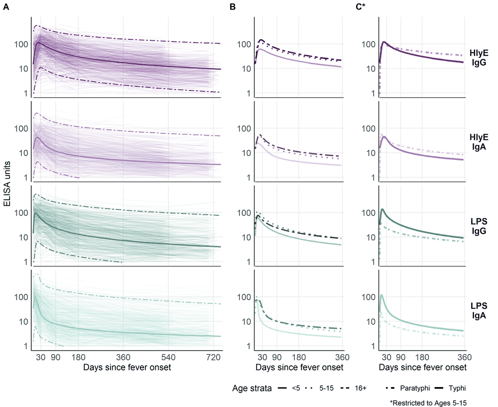



```{r}
#| include: false
knitr::opts_chunk$set(message = FALSE)

# The simulation studies in this article are expensive, and it renders to
# three formats, so every chunk would otherwise execute three times per build.
# `sim_pop_data_multi_cached()` and `est_seroincidence_by_cached()` write their
# results here; the directory is committed, so a fresh build reuses them.
sim_cache <- "precomputed/"
```

# Infectious disease epidemiology

## *Salmonella* enterica ("typhoid fever")

::: {.columns}

::: {.column width="60%"}

* ~21.7 million symptomatic cases/year
* ~217,000 deaths/year (~1% case fatality with treatment; up to 20% untreated)
* Highest burden: ages 5–19
* **Symptoms:** sustained high fever, severe headache, abdominal pain, malaise; rose-spot rash (~30% of patients); constipation (early) or diarrhea (later)

:::

::: {.column width="40%"}
<!-- Keep a blank line between these two images: without it Pandoc reads them as
one paragraph of inline images and silently drops both captions, taking the
CC BY-SA attribution for the map with them. -->

{fig-alt="Photomicrograph of Salmonella Typhi bacteria with a flagellar stain"}

, [CC BY-SA 3.0](https://creativecommons.org/licenses/by-sa/3.0/).](../man/figures/Fievre_typhoide.png){fig-alt="World map showing high (red) and moderate (orange) typhoid-burden countries"}

:::

:::

## *Shigella* ("dysentery")

::: {.columns}

:::: {.column width="50%"}

  * ~100 million infections annually
  * ~100,000 deaths annually (~1% case fatality; higher in malnourished children)
  * Most cases and deaths: children under 5 in low- and middle-income countries (LMICs)
  * **Symptoms:** bloody diarrhea (dysentery), abdominal cramps, fever, tenesmus (painful urge to defecate)
     
::::

:::: {.column width="50%"}

.](../man/figures/Shigella_stool.jpg){fig-alt="Microscopy of a stool sample containing Shigella bacteria"}
::::

:::

## *Orientia tsutsugamushi* ("scrub typhus")

::: {.columns}

:::: {.column width="50%"}

  * ~1,000,000 infections/year
  * ~10,000 deaths/year (~1% case fatality with treatment; up to 30% untreated)
  * **Symptoms:** high fever, severe headache, myalgia; eschar (pathognomonic black scab at mite-bite site); macular rash; cough; gastrointestinal symptoms; hemorrhage in severe cases

::::

:::: {.column width="50%"}

, [CC BY-SA 3.0](https://creativecommons.org/licenses/by-sa/3.0/).](../man/figures/Trombicula-larva-stylostome.jpg){fig-alt="Microscopy of a Trombicula mite larva with its stylostome feeding tube"}
::::

:::

# Why estimate incidence from serosurveys?

## The burden-data gap {.smaller}

::: {.columns}

:::: {.column width="55%"}

* Typhoid conjugate vaccines (TCVs) are **80-90% effective** and
WHO-recommended since 2018, but **few countries** have adopted them into
routine immunization.

* A major barrier is the **lack of burden data**: most low- and
middle-income countries lack robust typhoid surveillance and have little
or no incidence data.

* These gaps block applications for vaccine funding,
widening **equity gaps** in access to effective vaccines.

::::

:::: {.column width="45%"}

```{r}
#| echo: false
#| fig-cap: >
#|   Countries with routine TCV introduction as of 2023.
#|   Source: CDC MMWR 72(7):182–188 (public domain).
#| fig-alt: >
#|   World map highlighting countries that have introduced typhoid conjugate
#|   vaccines (TCV) into routine immunization (green). As of 2023 only a
#|   handful of countries — Pakistan, Nepal, Liberia, Zimbabwe, Malawi, and
#|   Samoa — have done so, despite much wider typhoid burden.
library(ggplot2)

# Countries with routine TCV introduction as of 2023
# Source: CDC MMWR 72(7):182–188, February 17, 2023 (public domain)
tcv_countries <- c(
  "Pakistan", "Nepal",
  "Liberia", "Zimbabwe", "Malawi",
  "Samoa"
)
world <- map_data("world")
world$status <- ifelse(
  world$region %in% tcv_countries,
  "TCV introduced", "Not yet introduced"
)
ggplot(world, aes(long, lat, group = group, fill = status)) +
  geom_polygon(colour = "white", linewidth = 0.1) +
  scale_fill_manual(
    values = c(
      "TCV introduced"     = "#1B9E77",
      "Not yet introduced" = "#BBBBBB"
    ),
    name = NULL
  ) +
  coord_fixed(1.3) +
  theme_void() +
  theme(
    legend.position = "bottom",
    legend.text = element_text(size = 8)
  )
```

::::

:::

::: notes
Three large randomized trials showed that a Vi tetanus-toxoid typhoid
conjugate vaccine is 80-90% effective at preventing symptomatic typhoid,
and the WHO has recommended these vaccines since 2018. Yet as of 2023 only
a handful of countries had introduced them into routine immunization. The
binding constraint is data: without incidence estimates, countries cannot
make the case for vaccine funding.

"Data inequality is our biggest challenge moving forward" --- Kathy Neuzil, 2023
:::



## Seroepidemiology can fill the gap

The Seroepidemiology and Environmental Surveillance for Enteric Fever
(SEES) study collected cross-sectional serosurveys across multiple
countries to estimate typhoid incidence from antibody data
[@Aiemjoy_2022_Lancet].

::: notes
This lecture describes the methodology behind that kind of estimate: how a
single cross-sectional serosurvey, combined with a model of antibody
dynamics, can recover an incidence rate.
:::

## Defining incidence

::: {#def-incidence}

#### Population incidence rate

The **incidence rate** of a disease over a **specific time period** is 
the rate at which individuals in a population are *acquiring* the disease 
during that time period [@Noordzij2010diseasemeasures].
:::



::: {#exm-incidence-rate}

#### Population incidence rate

If there are **10 new cases** of typhoid 
in a population of **1000 persons** 
during a **one month** time period, 
then the **incidence rate** for that time period is
**10 new cases per 1000 persons per month**.
:::

## Mathematical definition of incidence

More precisely, the incidence rate at time $t$ is the **rate of new
infections per person at risk**:

$$\lambda_t = \frac{1}{N(t)}\,\frac{d}{dt}\,\mathbb{E}[C(t)]$$

where $C(t)$ is the cumulative number of infections and $N(t)$ the number of
individuals at risk at time $t$.

## Scale of incidence rates

In both definitions, 
the units for an incidence rate are 
"# new infections per # persons at risk per time duration"; 
for example, "new infections per 1000 persons per year". 

For convenience, 
we can rescale the incidence rate to make it easier to understand; 
for example, we might express incidence as 
"# new infections per 1000 persons per year" 
or "# new infections per 100,000 persons per day", etc.

## Incidence from an individual's perspective

From the perspective of an individual in the population:

* the **incidence rate** (at a given time point $t$)
is the instantaneous **probability density** of
**becoming infected** at that time point,
**given** that they are **at risk** at that time point.

* That is, the incidence rate is a **hazard** rate.

* Notation: let's use **$\lambda_{t}$** to denote the incidence rate at time $t$.

# Study designs for estimating incidence rates

## Longitudinal cohort studies

Incidence rates can be estimated from longitudinal cohort studies,
but cohort studies are:

- costly to conduct
- slow to produce results, 
- vulnerable to selection and censoring (drop-out) biases

## Clinical case data

Incidence rates can also be estimated from clinical case rates,
but clinical case rates undercount:

- asymptomatic cases
- symptomatic cases who don't receive clinical care.

## Cross-sectional serosurveys

::: notes

Alternatively, incidence rates can be estimated from biomarker data
collected through a single cross-sectional survey, 
combined with a longitudinal model of 
how those biomarkers respond to infection over time.
Compared with cohort studies and clinical case rates,
cross-sectional incidence estimation can 
produce estimates that are:
:::

- accurate
- timely
- cost-efficient

See @HAY2024100806 for an overview.

# Estimating incidence from cross-sectional serosurveys

## Goal

> Easily and reproducibly translate **quantitative antibody responses**
> at the population level into meaningful and accurate **epidemiological
> measures of infection burden**.

## Antibody responses are complicated {.incremental}

Using antibody levels to recover infection times is hard, because antibody
responses:

::: incremental

* **decay over time** after infection
* **vary from individual to individual** (age, immune function, prior
infections, vaccination)
* **vary from measurement to measurement** (assay noise)
* can **cross-react** with antibodies from other exposures

:::

::: notes
Each of these complications has to be handled somewhere in the model:
waning, between-person heterogeneity, measurement error, and
cross-reactivity. The rest of this section builds that model up piece by
piece.
:::

## Cross-sectional antibody surveys {.incremental}

::: notes
Typically, it is difficult to estimate changes from a single time point. 
However, we can sometimes make assumptions that allow us to do so. 
In particular, if we assume that the incidence rate is constant over time, 
then we can estimate incidence from a single cross-sectional survey.

We will need two pieces of notation to formalize this process.

:::

::: incremental

* We recruit participants from the population of interest.

* For each survey participant, we measure antibody levels $(Y)$ 
for the disease of interest

* Each participant was **most recently infected** at some time $(T)$
**prior** to when we measured their antibodies.

::: notes
* If a participant has never been infected since birth, then $T$ is undefined.

:::

* $T$ is a **latent, unobserved variable**.

::: notes
* We **don't directly observe $T$**; we **only observe $Y$**, 
which we hope tells us something about $T$ and $\lambda$.

:::

:::

## Modeling assumptions

::: {#def-constant-incidence-model}

#### Constant-incidence model

In the **constant-incidence model**:

* incidence is **constant over time** and **homogeneous across the
  population**, so a single number describes the whole sample,
  $$\lambda_{i,t} = \lambda, \quad \forall i,t$$
  (subpopulations can be analyzed separately to make this more
  plausible); and

* there is **no lasting immunity**: participants are always at risk of
  a new infection, regardless of how recently they were last infected.

:::

::: notes
(For diseases like typhoid,
the no-immunity assumption may not hold exactly,
but hopefully approximately;
modeling the effects of re-exposure during an active infection is
[on our to-do list](https://github.com/UCD-SERG/serodynamics/issues/11)).
:::

## Time since infection and incidence {.smaller}

::: {#prp-time-since-infection}

#### Distribution of time since last infection

Under the constant-incidence model (@def-constant-incidence-model), a participant's time since last
infection, $T$, is **exponentially distributed with rate $\lambda$**,
truncated at their age $a$: no one can have been infected before they
were born, so the density is supported on $[0,a]$ and the remaining
probability, $\expf{-\lambda a}$, falls on "never infected":

$$
\dens(T=t|A=a) = 1_{t \in[0,a]} \red{\lambda \expf{-\lambda t}} +
1_{t = \NA} \expf{-\lambda a}
$$

Its rate parameter is exactly the incidence rate of @def-incidence, and that identity is what makes $T$ worth recovering.
:::

::: notes
This is a time-to-event model,
looking **backwards in time** from the survey date
(when the blood sample was collected).

The probability that
an individual was **last** infected $t$ days ago, $p(T=t)$,
is equal to the probability of being infected at time $t$
(i.e., the incidence rate at time $t$, $\lambda$)
times the probability of not being infected after time $t$,
which turns out to be $\expf{-\lambda t}$.

The distribution of $T$ is truncated by the patient's birth date;
the probability that they have never been infected is
$\expf{-\lambda a}$,
where $a$ is the patient's age at the time of the survey.
:::

## Maximum likelihood estimation {.smaller}

Several approaches could estimate $\lambda$ from the data.
`serocalculator` uses **maximum likelihood**: it reports the value of
$\lambda$ that makes the observed data most probable.
Stating that precisely takes three definitions.

::: {#def-likelihood}

#### Likelihood

The **likelihood** is the probability (or density) of the observed
data, read as a function of the parameter rather than of the data:

$$\Lik(\lambda) \eqdef \dens(\text{data} \mid \lambda)$$

:::



::: {#def-log-likelihood}

#### Log-likelihood

The **log-likelihood** is the log of the likelihood (@def-likelihood):

$$\llik(\lambda) \eqdef \logf{\Lik(\lambda)}$$
:::

::: notes
The log-likelihood is maximized at the same $\lambda$ as the likelihood,
and is easier to work with because the logarithm turns products into sums
([the logarithm-of-a-product theorem](https://d-morrison.github.io/rme/chapters/math-prereqs.html#thm-log-prod)
in *Regression Models for Epidemiology*).
:::



::: {#def-score}

#### Score function

The **score function** is the derivative of the log-likelihood with
respect to the parameter (in general, its gradient):

$$\score(\lambda) \eqdef \deriv{\lambda}\llik(\lambda)$$

A maximum likelihood estimate $\hat\lambda$ solves the **score
equation** $\score(\hat\lambda) = 0$.
:::

## Likelihood of latent infection times {.smaller}

If the infection times $T$ were observed directly, these would all
take a simple closed form:



## Example log-likelihood curves

::: notes
Here's what that would look like:
:::

```{r}
#| fig-cap: "log-likelihood curve for latent data"
#| label: fig-ex-lik-curves
library(serodynamics)
library(serocalculator)
library(dplyr)
antibodies <- c("HlyE_IgA", "HlyE_IgG")
set.seed(1)

sim_case_data <-
  serocalculator::typhoid_curves_nostrat_100 |>
  sim_case_data(n = 5, 
                antigen_isos = antibodies,
                max_n_obs = 20, followup_interval = 14)

t1 <- sim_case_data$timeindays
loglik0 <- function(lambda) {
  sum(
    dexp(t1, rate = lambda, log = TRUE)
  )
}
loglik1 <- Vectorize(loglik0, vectorize.args = "lambda")

library(ggplot2)

ggplot() + 
  geom_function(fun = loglik1) +
  xlim(0, .1) +
  theme_bw() +
  xlab("lambda") +
  ylab("log-likelihood")

```

```{r}
#| include: false
# `typhoid_curves_nostrat_100` is `load_sr_params()` applied to the OSF
# object `rtw5k`, filtered to iter %in% 1:100, so filtering it further to
# iter < 50 is identical to filtering the raw OSF object the same way ---
# no need to fetch or vendor a separate copy of rtw5k for this.
curves <-
  typhoid_curves_nostrat_100 |>
  filter(iter < 50) |>
  filter(antigen_iso %in% antibodies)

# Cross-sectional data derived from OSF resource n6cp3, with corrected
# pseudonymous participant linkage --- see precomputed/osf/README.md.
xs_data <-
  "precomputed/osf/n6cp3.rds" |>
  load_pop_data()

# Noise parameters, vendored from OSF (osf.io/hqy4v):
noise <- readRDS("precomputed/osf/hqy4v.rds")
```

## Standard errors

How precisely the data pin down $\hat\lambda$ depends on how sharply
the log-likelihood peaks at its maximum, which takes two more
definitions to make precise.

::: {#def-hessian}

#### Hessian

The **Hessian** is the second derivative of the log-likelihood with
respect to the parameter (in general, the matrix of its second partial
derivatives):

$$\hess(\lambda) \eqdef \dderiv{\lambda}\llik(\lambda)$$
:::



::: {#def-observed-information}

#### Observed information

The **observed information** is the negative Hessian (@def-hessian):

$$\oinf(\lambda) \eqdef -\hess(\lambda)$$

A sharper peak at the maximum means a larger observed information.
:::



::: {#thm-mle-asymptotic-variance}

#### Asymptotic variance of the MLE

Under standard regularity conditions, the variance of a maximum
likelihood estimate is approximately the inverse of the observed
information (@def-observed-information) at that estimate:

$$\hVar{\hat\lambda} \approx \sb{\oinf(\hat\lambda)}^{-1}$$
:::

The standard error is the square root of that variance, so:

more curvature $\rightarrow$
a sharper likelihood peak $\rightarrow$
more observed information $\rightarrow$
smaller standard errors.

## Hessian for the exponential model {.smaller}

::: {#exm-hessian-exponential}

#### Latent-time exponential model

For the latent-time model of @prp-mle-fully-observed, the log-likelihood is
$$\llik^*(\lambda) = n\logf{\lambda} - \lambda\sum_{i=1}^n t_i$$

so its score (@def-score) and Hessian (@def-hessian) are

$$
\begin{aligned}
\llik^{*\prime}(\lambda) &= \frac{n}{\lambda} - \sum_{i=1}^n t_i
\\
\llik^{*\prime\prime}(\lambda) &= -\frac{n}{\lambda^2}
\end{aligned}
$$

and its observed information (@def-observed-information) is
$-\llik^{*\prime\prime}(\lambda) = n/\lambda^2$.

At the MLE $\hat\lambda = 1/\bar t$, @thm-mle-asymptotic-variance then gives

$$
\begin{aligned}
\hVar{\hat\lambda}
&\approx \left[-\llik^{*\prime\prime}(\hat\lambda)\right]^{-1}
\\&= \frac{\hat\lambda^2}{n}
\\
\hSEf{\hat\lambda}
&\approx \frac{\hat\lambda}{\sqrt{n}}
\end{aligned}
$$

so the standard error shrinks like $1/\sqrt{n}$: quadrupling the sample
size halves it.
:::

## Likelihood of observed data

::: notes
Unfortunately, we don't observe infection times $T$; 
we only observe antibody levels ${Y}$. 
So things get a little more complicated.

In short, we are hoping that we can estimate 
$T$ (time since last infection) 
from $Y$ (current antibody levels). 
If we could do that, 
then we could plug in our estimates $\hat t_i$ 
into that likelihood above, 
and estimate $\lambda$ as previously.

We're actually going to do something a little more nuanced; 
instead of just using one value for $\hat t$, 
we are going to consider all possible values of $t$ for each individual.

We need to link the data we actually observed to the incidence rate.

The likelihood of an individual's observed data, 
$\dens(Y=y)$, 
can be expressed as an integral over 
the joint likelihood of $Y$ and $T$ 
(using the Law of Total Probability):
:::

::: incremental

* $$\dens(Y=y) = \int_t \dens(Y=y,T=t)dt$$

:::: notes
Further, we can express the joint probability $p(Y=y,T=t)$ as the product of 
$p(T=t)$ and 
$p(Y=y|T=t)$ the "antibody response curve after infection". 
That is:
::::

* $$\dens(Y=y,T=t) = \dens(Y=y|T=t) \dens(T=t)$$

:::

## Antibody response curves

::: {#fig-sim-case-data}
```{r}

sim_case_data |>
  autoplot(alpha = .5)

```

Antibody response curves, $p(Y=y|T=t)$, for typhoid

:::



::: {#fig-decay}

```{r}
case_data <-
    serodynamics_example(
      "SEES_Case_Nepal_ForSeroKinetics_02-13-2025.csv"
    ) |>
    readr::read_csv() |>
    dplyr::mutate(
      .by = person_id,
      visit_num = dplyr::row_number()
    ) |>
    as_case_data(
      id_var = "person_id",
      biomarker_var = "antigen_iso",
      value_var = "result",
      time_in_days = "dayssincefeveronset"
    )

most_obs <-
  case_data |>
  count(id) |> 
  arrange(desc(n)) |> 
  head(10)
  
case_data |> 
  semi_join(most_obs, by = "id") |> 
    autoplot(alpha = .5, log_x = FALSE)
```

Observed antibody measurements over time since fever onset, for typhoid

:::

## The per-person likelihood {.smaller}

::: {#prp-marginal-likelihood}

#### Marginal likelihood of one participant's data

Substituting $\dens(Y=y,T=t) = \dens(Y=y|T=t)\,\dens(T=t)$ into the
expression for $\dens(Y=y)$ above gives one participant's contribution:

$$\dens(Y=y) = \int_t \dens(Y=y|T=t)\,\dens(T=t)\, dt$$

That integral is shorthand, because $T$ is not purely continuous: it has
the **mixed** distribution of @prp-time-since-infection, continuous on
$[0,a]$ plus an atom at $T=\NA$.
Written out over both parts, the integral is

$$
\dens(Y=y) =
\int_0^a \dens(Y=y\mid T=t)\,\lambda\expf{-\lambda t}\,dt
\;+\;
\dens(Y=y\mid T=\NA)\cdot \expf{-\lambda a}
$$

The first term is the contribution from subjects infected at least
once; the second is the contribution from subjects never infected.
:::

::: notes
Two pieces here were not yet defined:

* $p(T=\NA) = \expf{-\lambda a}$ is already known --- the same
never-infected probability from @prp-time-since-infection.
* $p(Y=y\mid T=\NA)$, the antibody response of a never-infected
subject, needs its own definition. Without any noise, a never-infected
subject's true antibody level is exactly zero, so this is a point mass
at $y=0$ (a Dirac delta): $p(Y=y\mid T=\NA) = \delta(y)$. Once
measurement noise and biological (cross-reactivity) noise are
introduced below, this point mass is handled differently by each ---
see "Noise and never-infected subjects".
:::

## The full-sample likelihood {.smaller}

::: {#prp-full-sample-likelihood}

#### Full-sample likelihood, assuming independent participants

Write $\Lik_i$ and $\llik_i$ for participant $i$'s own likelihood and
log-likelihood, which is @prp-marginal-likelihood evaluated at
$y = y_i$:

$$
\begin{aligned}
\Lik_i(\lambda) &= \dens(Y = y_i)
\\
\llik_i(\lambda) &= \logf{\Lik_i(\lambda)}
\end{aligned}
$$

If participants are **independent** of one another, the likelihood
(@def-likelihood) of the whole sample
$\vec{y} = (y_1, y_2, \ldots, y_n)$ is their product:

$$\Lik(\lambda) = \prod_{i=1}^n \Lik_i(\lambda)$$
:::

::: notes
Independence is what licenses the product; the latent-time likelihood
$\Lik^*$ above multiplies participants' contributions for the same
reason.
It is an assumption about the **sampling design**, separate from the
assumptions about disease dynamics in @def-constant-incidence-model.

If we know $\dens(Y=y|T=t)$, then we can maximize $\Lik(\lambda)$ over
$\lambda$ to find the "maximum likelihood estimate" (MLE) of $\lambda$,
denoted $\hat\lambda$.
:::

## Finding the MLE numerically

::: notes
Taking logs turns that product into a sum:
:::

$$
\begin{aligned}
\llik(\lambda)
&= \logf{\prod_{i=1}^n \Lik_i(\lambda)}
\\&= \sum_{i=1}^n \llik_i(\lambda)
\end{aligned}
$$

::: notes

Each $\llik_i$ is the log of an integral (@prp-marginal-likelihood),
so the derivative of this sum doesn't come out cleanly,
and we use a *numerical method*
(specifically, a Newton-type algorithm,
implemented by `stats::nlm()`)
to find the MLE.
That algorithm also returns a numerical Hessian (@def-hessian) at the maximum, and @thm-mle-asymptotic-variance turns that Hessian into a standard error.

:::

## Cluster-robust standard errors for clustered sampling designs



# Modeling the seroresponse kinetics curve



## Variation across the posterior {.smaller}



## Multiple biomarkers



## Variation in antibody kinetics: by country {.smaller}

Antibody-decay kinetics are not identical across populations. Estimated
seroresponse parameters vary by **country**, **age**, and **serotype**
(*Typhi* vs *Paratyphi* A).

{fig-alt="Antibody decay curves and distributions of peak level and decay rate, stratified by country, for four antigen-isotypes"}

## Variation in antibody kinetics: by age and serotype {.smaller}

{fig-alt="Antibody decay curves stratified by age group and by Typhi versus Paratyphi A serotype, for four antigen-isotypes"}

::: notes
This heterogeneity is why we stratify the analysis (for example by country
and age group) and why extending the model to handle covariates directly
is on the roadmap.
:::

# Estimating the curves with `serodynamics`

## Where do the curve parameters come from?

The decay curves above are themselves **estimated** from longitudinal
antibody measurements on **confirmed cases** --- individuals with a known
infection date who are sampled repeatedly afterward. Fitting the two-phase
model to those data yields, for each antigen-isotype, the parameters the
incidence model needs:

* baseline antibody level ($y_0$)
* peak concentration ($y_1$)
* time to peak ($t_1$)
* decay rate ($\alpha$)
* decay shape ($r$)

## The `serodynamics` package {.smaller}

[`serodynamics`](https://github.com/UCD-SERG/serodynamics) is an
open-source R package that fits this two-phase within-host kinetics model
with a **Bayesian hierarchical** model, sampled by MCMC (via JAGS). The
hierarchical structure stabilizes individual-level estimates by borrowing
strength across participants --- valuable when longitudinal data are sparse.

::: notes
The same modeling framework has been applied to pertussis, typhoid, scrub
typhus, and *Shigella*. Previously each application re-implemented the JAGS
model specification, data formatting, and post-processing by hand;
`serodynamics` packages that into a single reusable, validated workflow.
:::

## A typical `serodynamics` workflow {.smaller}

```{r}
#| eval: false
#| echo: true
library(serodynamics)

# Longitudinal confirmed-case data (example data ships with the package)
data("nepal_sees")

# Fit the two-phase model by MCMC (JAGS); slow, so not run here
fit <- run_mod(data = nepal_sees, with_post = TRUE)

# Check convergence, then export serocalculator-ready curve parameters
plot_jags_Rhat(fit)
curve_params <- postprocess_jags_output(fit)
```

::: notes
`run_mod()` runs several MCMC chains for tens of thousands of iterations,
so a real fit takes minutes to hours; the package ships ready-made example
output (`nepal_sees_jags_output`) for experimentation.
:::

## What a fitted model looks like {.smaller}

The package ships a cached example fit; `plot_jags_dens()` shows the
posterior densities of the five kinetic parameters (here HlyE IgG, *Typhi*),
overlaid by MCMC chain:

::: notes
The overlapping chains indicate good convergence.
:::

```{r}
#| eval: false
#| echo: true
data("nepal_sees_jags_output")
plot_jags_dens(nepal_sees_jags_output, iso = "HlyE_IgG", strat = "typhi")
```

{fig-alt="Five posterior density panels (alpha, shape, t1, y0, y1) with two overlapping MCMC chains"}

## Two packages, one pipeline

* **`serodynamics`** (upstream): longitudinal **confirmed-case** data
$\rightarrow$ estimated antibody-decay **curve parameters**
* **`serocalculator`** (downstream): a **cross-sectional serosurvey** plus
those curve parameters $\rightarrow$ a **seroincidence** estimate

The output of `serodynamics` feeds directly into `serocalculator`'s
`est_seroincidence_by()`.

## Propagating uncertainty and heterogeneity {.smaller}

The seroresponse model $\dens(Y=y|T=t)$ is **not a single fixed curve**.
`serodynamics` returns a posterior **sample** of curve-parameter sets
$\theta^{(1)},\dots,\theta^{(M)}$ (each $\theta^{(k)} = (y_0, y_1, t_1, \alpha, r)^{(k)}$),
which together capture both

::: incremental

* **estimation uncertainty** in the kinetics parameters, and
* **between-person / between-case heterogeneity** in the seroresponse.

:::

::: notes
Each draw is one plausible antibody-response curve; together they describe
the distribution of responses across cases and our uncertainty about it.
:::



The incidence likelihood **averages over these draws** (Monte Carlo
integration), so each person's contribution becomes

$$
\dens(Y=y) \approx \frac{1}{M}\sum_{k=1}^{M}
\int_t \dens(Y=y|T=t, \theta^{(k)})\; \dens_\lambda(T=t)\, dt
$$

::: notes
Because the curve-parameter distribution is marginalized into the likelihood
this way, the resulting $\hat\lambda$ and its standard error reflect the
seroresponse heterogeneity and the parameter uncertainty --- they are not
conditional on a single point-estimated curve. In `serocalculator` this is
the average over the Monte Carlo parameter sets (the `iter` draws) carried in
the curve-parameter object.
:::

## Random effects and variance over time {.smaller}

The longitudinal model distinguishes two kinds of variation:

* **Conditional observation noise:** given a person's kinetic parameters
  $\theta_i$, residual noise has constant variance on the log-antibody scale.
* **Marginal population variation:** because $\theta_i$ includes random
  effects --- notably the waning rate $\alpha_i$ --- individual trajectories
  can spread apart with increasing time since infection.

Thus, even without an explicit time-varying residual variance $\sigma^2(t)$,
the variance around the population mean trajectory can vary with $t$:

$$
\operatorname{Var}(\log Y(t)\mid T=t)
= \sigma_{\log Y}^2
+ \operatorname{Var}_{\theta}\!\left[\log y(t;\theta)\right].
$$

::: notes
This is the distinction between *conditional* and *marginal*
heteroscedasticity. The `serodynamics` observation model uses one residual
precision per antigen-isotype, shared across subjects and observation times.
It therefore does not fit an additional residual-variance function of time.

Nevertheless, its subject-level kinetic parameters are random effects with a
joint distribution. For illustration, if post-peak decay were exponential
($r=1$), with the other parameters held fixed,

$$
\log y_i(t) = \log y_1 - \alpha_i(t-t_1),
$$

so variation in $\alpha_i$ alone contributes
$(t-t_1)^2\operatorname{Var}(\alpha_i)$ to the population variance on the log
scale. The full nonlinear model also allows the other kinetic parameters and
their correlations to affect how the variance changes over time.

`serocalculator` accounts for this trajectory-induced variation by averaging
the incidence likelihood over the Monte Carlo sample of kinetic-parameter
sets. It does not reclassify that variation as observation noise or replace it
with a fitted $\sigma^2(t)$. Its separate biological- and measurement-noise
models have constant additive and relative widths, respectively; neither
width is an explicit function of time since infection.
:::

# Using `serocalculator`

## An open-source R package



## Simulating a cross-sectional survey {.smaller}



## Noise parameters



## The simulated antibody distribution



## Estimating incidence from the simulated survey {.smaller}



## Estimating seroincidence in real data {.smaller}



## Interactive Shiny app



# Validation: recovering known incidence rates {#sec-validation}

## Simulating clusters with known incidence {.smaller}



## Estimating incidence in each cluster {.smaller}



## Inspecting individual clusters {.smaller}



## Checking `nlm()` convergence {.smaller}



## Estimates recover the simulated rates {.smaller}



## A caveat: renewing parameters at each infection {.smaller}



# Ongoing and future work

## In-progress work

* Extending and improving existing Shiny apps for these methods
  (e.g., the [serocalculator Shiny app](https://ucdserg.shinyapps.io/shiny_serocalculator/),
  [source](https://github.com/UCD-SERG/shiny_serocalculator))

* Multivariate modeling of biomarkers (relaxing conditional independence)

* A graphical (Shiny) app for `serodynamics`

* Modeling time-varying incidence rates

* Accounting for re-exposure

* Accounting for latent immunocompromised subpopulations

* Calibrating to population demographics

## Multiple biomarkers: beyond conditional independence {#sec-multivariate .smaller}

With several biomarkers (e.g. HlyE IgA and IgG), the current method treats
them as **conditionally independent given the time since infection**, so the
joint likelihood factors into a product of per-biomarker terms:

$$
\dens(Y_1 = y_1, Y_2 = y_2 \mid T=t) =
\dens(Y_1 = y_1 \mid T=t)\,\dens(Y_2 = y_2 \mid T=t)
$$

::: notes
This is the same conditional-independence simplification that naive Bayes
makes (features independent given the class): convenient, but it ignores any
within-person correlation between biomarkers.
:::

. . .

Kwan Ho Lee (UCD-SERG) is relaxing this to allow **covariance** among
biomarkers --- a multivariate seroresponse model with a Kronecker-structured
covariance, fit in Stan
([UCD-SERG/shigella#13](https://github.com/UCD-SERG/shigella/pull/13)).

# References {.smaller .unnumbered}

::: {#refs}
:::
